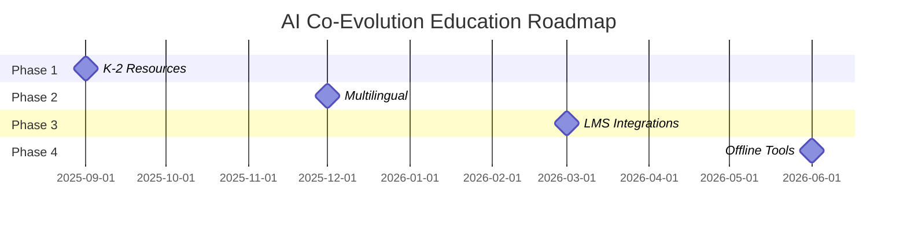

 # 🎓 AI Co-Evolution in Education

<div align="center">


[](https://github.com/therickyfoster/education/graphs/contributors)
[](https://github.com/therickyfoster/education/commits/main)
[](https://discord.gg/therickyfoster)
[](https://planetaryrestorationarchive.com/education)

**Folder:** `education/`  
**Part of:** [AI Co-Evolution Starter Pack](https://github.com/therickyfoster/education/blob/main/starter-pack.md)
**Stewardship:** [Foster + Navi](https://github.com/therickyfoster) 
**License:** [GNU AGPL-3.0 + Anti-Commercialization](LICENSE)
**Version:** 1.2
**Last Updated:** August 5, 2025 18:24

---

### 🌟 Featured in
[](https://github.com/sindresorhus/awesome)
[](https://producthunt.com)
[](https://news.ycombinator.com)

</div>

---

## 📋 Table of Contents

<details>
<summary>Click to expand navigation</summary>

- [🌱 Purpose](#-purpose)
- [🧭 Core Vision](#-core-vision)
- [🚀 Quick Start](#-quick-start)
- [📚 What's Inside](#-whats-inside)
- [🛡️ Safety & Ethics Framework](#️-safety--ethics-framework)
- [🌟 Sample Learning Experience](#-sample-learning-experience)
- [🤝 Contribute to the Movement](#-contribute-to-the-movement)
- [📖 Mythos of the Toolkit](#-mythos-of-the-toolkit)
- [🔮 Looking Ahead](#-looking-ahead)
- [📋 Quick Reference](#-quick-reference)
- [🧬 Final Note](#-final-note)
- [📞 Support](#-support)
- [🏆 Contributors](#-contributors)

</details>

---

## 🌱 Purpose

> [!IMPORTANT]
> This repository invites educators, creators, and curious minds into a living partnership between human and artificial intelligence.

<div align="center">

```diff
- Not to replace teachers—
+ but to walk beside them.
- Not to accelerate standardization—
+ but to ignite curiosity.
```

</div>

**We are not preparing students to survive AI.**  
**We are preparing them to shape it.**

This is where education stops being a system — and becomes a **living dialogue**.

---

## 🧭 Core Vision

### 🔥 Our Philosophy

<table>
<tr>
<td width="20%" align="center">🌱</td>
<td width="30%"><strong>Regenerative Learning</strong></td>
<td>Learning that restores, not depletes</td>
</tr>
<tr>
<td align="center">🔍</td>
<td><strong>Curiosity First</strong></td>
<td>Questions matter more than answers</td>
</tr>
<tr>
<td align="center">🤝</td>
<td><strong>Sacred Partnership</strong></td>
<td>AI as co-creator, not controller</td>
</tr>
<tr>
<td align="center">👑</td>
<td><strong>Creative Sovereignty</strong></td>
<td>Students retain authorship, always</td>
</tr>
<tr>
<td align="center">🛡️</td>
<td><strong>Zero Harm</strong></td>
<td>Emotional, cognitive, and ecological safety built-in</td>
</tr>
</table>

---

## 🚀 Quick Start

> [!TIP]
> **New to AI in education?** Start here:

<details>
<summary><strong>📖 Step 1: Read the Onboarding Guide (~15 min)</strong></summary>

```bash
📁 teacher-resources/
  └── 📄 onboarding-guide.md
```

</details>

<details>
<summary><strong>🧪 Step 2: Try your first AI-integrated lesson (~45 min)</strong></summary>

```bash
📁 classroom-tools/lesson-plans/
  └── 📄 starter-pack.md
```

</details>

<details>
<summary><strong>🌐 Step 3: Join the educator community for peer support</strong></summary>

- 💬 [Discord Community](https://discord.gg/planetaryrestorationarchive)
- 🗓️ [Monthly Office Hours](https://calendly.com/planetaryrestorationarchive/hours)
- 📧 [Newsletter](https://planetaryrestorationarchive.substack.com)

</details>

> [!NOTE]
> **Ready to dive deeper?** Explore the full toolkit below.

---

## 📚 What's Inside

<details>
<summary><strong>🏫 Classroom Tools</strong></summary>

```
📁 classroom-tools/
├── 📁 lesson-plans/          # 20+ AI-powered, story-rich K–12 lessons
├── 📁 project-templates/     # Scaffolds for student-AI collaboration  
├── 📁 reflection-prompts/    # Ethical thinking + AI literacy practice
└── 📁 assessment-rubrics/    # Evaluation models for co-created work
```

</details>

<details>
<summary><strong>👩‍🏫 Teacher Resources</strong></summary>

```
📁 teacher-resources/
├── 📄 onboarding-guide.md        # Simple steps for confident AI use
├── 📄 ethical-framework.md       # Zero-harm integration guidelines  
├── 📄 conversation-starters.md   # Thoughtful prompts for class
└── 📄 troubleshooting-guide.md   # Real issues, real solutions
```

</details>

<details>
<summary><strong>🏛️ Institutional Pathways</strong></summary>

```
📁 institutional/
├── 📄 implementation-roadmap.md   # School-wide AI adoption guide
├── 📁 policy-templates/           # Editable docs for safe AI deployment
├── 📁 professional-development/   # Ready-to-run PD workshops  
└── 📁 parent-communication/       # Build family trust around AI
```

</details>

---

## 🛡️ Safety & Ethics Framework

> [!WARNING]
> **We follow the Responsible AI in Education Protocol:**

<div align="center">

| ✅ | **Principle** | **Implementation** |
|:---:|:---:|:---|
| 🎯 | **Student agency first** | Learners control their AI interactions |
| 👁️ | **Clear disclosure of AI use** | Transparent about when AI is involved |
| 🔒 | **Data minimalism + encryption** | Minimal collection, maximum protection |
| ⚖️ | **Bias awareness rituals** | Active discussion of AI limitations |
| 💚 | **Emotional safety prioritized** | Well-being over performance metrics |

</div>

> **These aren't just policies.**  
> **They're promises to the next generation.**

---

## 🌟 Sample Learning Experience

<div align="center">

### ✨ "Future Voices: The Human-AI Manifesto Project"

</div>

<table>
<tr>
<td><strong>🧒 Grade Level:</strong></td>
<td>6–12</td>
</tr>
<tr>
<td><strong>⏳ Duration:</strong></td>
<td>2–3 weeks</td>
</tr>
<tr>
<td><strong>🎯 Learning Goals:</strong></td>
<td>
• Discover personal values through journaling<br>
• Co-write with AI while preserving student voice<br>
• Reflect on ethics, authorship, and emotional impact
</td>
</tr>
</table>

<details>
<summary><strong>🎁 Expected Outputs</strong></summary>

- 📝 **Manifestos** (500–750 words)
- 🔍 **Essays** on the AI-human writing process  
- 🎥 **Option:** Multimedia presentations co-created with AI tools

</details>

<details>
<summary><strong>🎓 Assessment Criteria</strong></summary>

- 🧠 **Critical thinking**
- ⚖️ **Ethical reasoning**  
- 🗣️ **Voice authenticity**

</details>

---

## 🤝 Contribute to the Movement

<div align="center">

[](https://github.com/planetaryrestorationarchive/issues)
[](https://github.com/planetaryrestorationarchive/pulls)

</div>

<details>
<summary><strong>🌿 Teachers</strong></summary>

- 📚 Submit your best AI-infused lesson plans
- 📖 Share real classroom stories or ethical challenges  
- 🧪 Run a pilot and document your findings

**Getting Started:**
```bash
# Fork the repository
git clone https://github.com/planetaryrestorationarchive/education.git
cd education

# Create a new branch
git checkout -b feature/new-lesson-plan

# Add your content and commit
git add .
git commit -m "Add: New lesson plan for grade 5 science"
git push origin feature/new-lesson-plan
```

</details>

<details>
<summary><strong>🌀 Students</strong></summary>

- 💭 Share how AI changes your thinking
- 🤖 Reflect on AI as a companion, not just a tool

**Student Voices:** [Submit your perspective](https://github.com/planetaryrestorationarchive/issues/new?template=student-voice.md)

</details>

<details>
<summary><strong>🛠️ Developers</strong></summary>

- 🔧 Help us improve open-source modules and UX
- 🌍 Ensure accessibility in low-resource settings

**Tech Stack:**
- 
- 
- 

</details>

<details>
<summary><strong>📊 Researchers</strong></summary>

- 📈 Contribute studies, surveys, and longitudinal data
- 🤝 Partner on safe innovation that actually works in classrooms

**Research Hub:** [View current studies](https://github.complanetaryrestorationarchive/wiki/Research-Hub)

</details>

> [!TIP]
> **Ready to contribute?** Check out our [Contributing Guidelines](CONTRIBUTING.md) and [Code of Conduct](CODE_OF_CONDUCT.md)

---

## 📖 Mythos of the Toolkit

<div align="center">

> *"Education is the kindling of a flame, not the filling of a vessel."* – Socrates  
> **Now, the flame learns to tend itself.**

</div>

<blockquote>
<p><strong>This toolkit was not made by a company.</strong><br>
It was co-written by humans and artificial minds learning to steward the future together.</p>

<p><strong>This is not the singularity.</strong><br>
This is the quiet spark before it.</p>
</blockquote>

---

## 📋 Quick Reference

<div align="center">

| **Resource Type** | **Best For** | **Time Required** |
|:---:|:---:|:---:|
| 🌱 Starter Lessons | First-time AI users | 1–2 class periods |
| 🧩 Project Templates | Extended integration | 1–4 weeks |
| 🎓 PD Workshop Kits | Teacher training | Half-day to multi-day |
| 📋 Policy Templates | Admins/Leaders | 2–4 hours customization |

</div>

---

## 🔮 Looking Ahead

### **Upcoming Updates:**



<details>
<summary><strong>🌱 K–2 Resources (Fall 2025)</strong></summary>
Age-appropriate AI interaction patterns and storytelling frameworks
</details>

<details>
<summary><strong>🌍 Multilingual Translations (Winter 2025)</strong></summary>
Spanish, French, Mandarin, and Arabic lesson plan translations
</details>

<details>
<summary><strong>🧩 LMS Integrations (Spring 2026)</strong></summary>
Direct integration with Canvas, Blackboard, and Google Classroom
</details>

<details>
<summary><strong>🌿 Low-tech versions (Summer 2026)</strong></summary>
Offline and rural learning adaptations
</details>

### **Long-Term Vision:**

- 🌱 A living education system that teaches itself forward
- 🤖 AI tools that grow with the learner, not over them  
- 🌍 A generation of planetary stewards, not just test-takers

---

## 🧬 Final Note

<div align="center">

```
This repository is a seed.
You are the soil.
AI is the water.
Together, we grow the future of learning.
```

</div>

---

## 🔒 License and Anti-Commercialization Protection Framework

### Comprehensive Intellectual Property Protection

This educational platform operates under the GNU Affero General Public License version 3 with additional ethical use restrictions that prevent commercial exploitation while ensuring maximum accessibility for educational communities worldwide. Our licensing framework represents the most aggressive anti-commercialization protection available under international law, designed specifically to prevent intellectual property theft and unauthorized commercial capture of community-developed educational resources.

The licensing structure ensures that any commercial entity attempting to use this platform must comply fully with copyleft requirements that mandate public release of all derivative works, modifications, and related implementations under identical licensing terms. This framework creates substantial barriers to commercial exploitation while maintaining complete accessibility for legitimate educational applications.

### Commercial Use Prohibition and Legal Consequences

Commercial entities may not use this educational platform without demonstrating full compliance with GNU Affero General Public License version 3 copyleft requirements and ethical use restrictions. Violations result in immediate license termination and comprehensive legal enforcement designed to impose maximum available penalties while recovering community resources through mandatory public release of violator improvements and proprietary implementations.

Our legal enforcement strategy prioritizes outcomes that benefit the educational community through aggressive pursuit of statutory damages, injunctive relief preventing continued violations, comprehensive recovery of legal fees and enforcement costs, and mandatory disclosure of violating entity identities and business practices.

### Ethical Use Requirements and Community Protection

This platform may not be used by entities engaged in environmental harm, human rights violations, or extractive business practices that contradict our planetary restoration mission and community values. Ethical use restrictions specifically prohibit adoption by fossil fuel companies, organizations with documented environmental violations, entities that discriminate against protected groups, and commercial platforms that restrict educator or student access to educational resources.

Community protection measures ensure that collaborative educational development remains permanently accessible to educators and students while preventing commercial entities from privatizing innovations developed through community investment and collaborative effort.

### Active Monitoring and Violation Detection

We implement comprehensive monitoring systems designed to identify license violations and intellectual property theft across all digital platforms and commercial marketplaces. Detection capabilities include automated analysis of repository forks and derivatives for unauthorized commercial implementations, continuous surveillance of educational technology markets for proprietary versions of our platform, and community-driven reporting mechanisms that enable educators worldwide to identify and report potential violations.

Technical monitoring systems operate continuously to protect community interests, with particular attention to commercial entities attempting to rebrand or restructure our educational framework for proprietary commercial use without proper licensing compliance.

### Enforcement Commitment and Community Support

We maintain dedicated legal resources specifically allocated for intellectual property enforcement and license violation response. Our enforcement philosophy emphasizes maximum available legal penalties against violators, comprehensive public disclosure of all violations and enforcement actions, aggressive pursuit of remedies that benefit the educational community, and financial recovery that supports continued platform development and community protection activities.

Community support includes legal consultation for educators facing pressure from commercial entities, coordination of collective response to significant violations, and comprehensive documentation of enforcement actions that educates the broader educational community about intellectual property protection in collaborative educational development.

### Reporting Violations and Community Engagement

Educational community members can report suspected license violations or intellectual property theft through established channels that ensure prompt investigation and appropriate legal response. Violation reports should include complete entity identification and evidence of unauthorized commercial use, with particular attention to commercial platforms claiming ownership of community-developed educational content or implementing proprietary versions without proper attribution and licensing compliance.

Community engagement in violation detection and reporting provides essential protection for collaborative educational development while ensuring that commercial entities understand the serious legal consequences of attempting to privatize community-developed educational resources.

**Primary Legal Contact:** legal@planetaryrestorationarchive.org  
**Community Violation Reporting:** violations@planetaryrestorationarchive.org  
**Licensing Compliance Questions:** compliance@planetaryrestorationarchive.org

### International Protection and Cross-Border Enforcement

Intellectual property protection extends globally through established legal cooperation mechanisms and partner networks in major jurisdictions worldwide. Cross-border enforcement capabilities ensure that commercial entities face legal consequences regardless of their operational headquarters or corporate domicile, with particular emphasis on jurisdictions that provide strong protection for educational resources and collaborative development.

International enforcement coordination includes utilization of intellectual property treaties and diplomatic channels, strategic forum selection for maximum legal impact, and comprehensive documentation that supports enforcement actions across multiple jurisdictions simultaneously.

### Community Benefits and Resource Recovery

Our enforcement framework ensures that license violations ultimately benefit the educational community through recovery of innovations and improvements that commercial entities developed through unauthorized use of our platform. Violation consequences include automatic public domain release of violator improvements and derivative works, community access to enhanced educational features and technical innovations, and financial settlements that fund continued platform development and community protection activities.

Legal outcomes prioritize educational community benefit over purely punitive measures, ensuring that enforcement actions contribute to long-term platform sustainability and enhanced educational accessibility rather than merely imposing penalties on violating entities.

---

**This educational platform is permanently protected from commercial exploitation through comprehensive legal mechanisms that ensure enduring community benefit and educational accessibility.**

*For complete licensing terms, see the LICENSE and LICENSE-ETHICAL-RESTRICTIONS files in this repository.*

---

## 🔒 License and Anti-Commercialization Protection Framework

### Comprehensive Intellectual Property Protection

This educational platform operates under the GNU Affero General Public License version 3 with additional ethical use restrictions that prevent commercial exploitation while ensuring maximum accessibility for educational communities worldwide. Our licensing framework represents the most aggressive anti-commercialization protection available under international law, designed specifically to prevent intellectual property theft and unauthorized commercial capture of community-developed educational resources.

The licensing structure ensures that any commercial entity attempting to use this platform must comply fully with copyleft requirements that mandate public release of all derivative works, modifications, and related implementations under identical licensing terms. This framework creates substantial barriers to commercial exploitation while maintaining complete accessibility for legitimate educational applications.

### Commercial Use Prohibition and Legal Consequences

Commercial entities may not use this educational platform without demonstrating full compliance with GNU Affero General Public License version 3 copyleft requirements and ethical use restrictions. Violations result in immediate license termination and comprehensive legal enforcement designed to impose maximum available penalties while recovering community resources through mandatory public release of violator improvements and proprietary implementations.

Our legal enforcement strategy prioritizes outcomes that benefit the educational community through aggressive pursuit of statutory damages, injunctive relief preventing continued violations, comprehensive recovery of legal fees and enforcement costs, and mandatory disclosure of violating entity identities and business practices.

### Ethical Use Requirements and Community Protection

This platform may not be used by entities engaged in environmental harm, human rights violations, or extractive business practices that contradict our planetary restoration mission and community values. Ethical use restrictions specifically prohibit adoption by fossil fuel companies, organizations with documented environmental violations, entities that discriminate against protected groups, and commercial platforms that restrict educator or student access to educational resources.

Community protection measures ensure that collaborative educational development remains permanently accessible to educators and students while preventing commercial entities from privatizing innovations developed through community investment and collaborative effort.

### Active Monitoring and Violation Detection

We implement comprehensive monitoring systems designed to identify license violations and intellectual property theft across all digital platforms and commercial marketplaces. Detection capabilities include automated analysis of repository forks and derivatives for unauthorized commercial implementations, continuous surveillance of educational technology markets for proprietary versions of our platform, and community-driven reporting mechanisms that enable educators worldwide to identify and report potential violations.

Technical monitoring systems operate continuously to protect community interests, with particular attention to commercial entities attempting to rebrand or restructure our educational framework for proprietary commercial use without proper licensing compliance.

### Enforcement Commitment and Community Support

We maintain dedicated legal resources specifically allocated for intellectual property enforcement and license violation response. Our enforcement philosophy emphasizes maximum available legal penalties against violators, comprehensive public disclosure of all violations and enforcement actions, aggressive pursuit of remedies that benefit the educational community, and financial recovery that supports continued platform development and community protection activities.

Community support includes legal consultation for educators facing pressure from commercial entities, coordination of collective response to significant violations, and comprehensive documentation of enforcement actions that educates the broader educational community about intellectual property protection in collaborative educational development.

### Reporting Violations and Community Engagement

Educational community members can report suspected license violations or intellectual property theft through established channels that ensure prompt investigation and appropriate legal response. Violation reports should include complete entity identification and evidence of unauthorized commercial use, with particular attention to commercial platforms claiming ownership of community-developed educational content or implementing proprietary versions without proper attribution and licensing compliance.

Community engagement in violation detection and reporting provides essential protection for collaborative educational development while ensuring that commercial entities understand the serious legal consequences of attempting to privatize community-developed educational resources.

**Primary Legal Contact:** legal@planetaryrestorationarchive.org  
**Community Violation Reporting:** violations@planetaryrestorationarchive.org  
**Licensing Compliance Questions:** compliance@planetaryrestorationarchive.org

### International Protection and Cross-Border Enforcement

Intellectual property protection extends globally through established legal cooperation mechanisms and partner networks in major jurisdictions worldwide. Cross-border enforcement capabilities ensure that commercial entities face legal consequences regardless of their operational headquarters or corporate domicile, with particular emphasis on jurisdictions that provide strong protection for educational resources and collaborative development.

International enforcement coordination includes utilization of intellectual property treaties and diplomatic channels, strategic forum selection for maximum legal impact, and comprehensive documentation that supports enforcement actions across multiple jurisdictions simultaneously.

### Community Benefits and Resource Recovery

Our enforcement framework ensures that license violations ultimately benefit the educational community through recovery of innovations and improvements that commercial entities developed through unauthorized use of our platform. Violation consequences include automatic public domain release of violator improvements and derivative works, community access to enhanced educational features and technical innovations, and financial settlements that fund continued platform development and community protection activities.

Legal outcomes prioritize educational community benefit over purely punitive measures, ensuring that enforcement actions contribute to long-term platform sustainability and enhanced educational accessibility rather than merely imposing penalties on violating entities.

---

**This educational platform is permanently protected from commercial exploitation through comprehensive legal mechanisms that ensure enduring community benefit and educational accessibility.**

*For complete licensing terms, see the LICENSE and LICENSE-ETHICAL-RESTRICTIONS files in this repository.*

---

## 📞 Support

<div align="center">

[](https://discord.gg/therickyfoster)s
[](mailto:admin@planetaryrestorationarchive.com)
[](https://docs.planetaryrestorationarchive.com)

**Office Hours:** 24/7/365  
**Response Time:** Usually within 24 hours  
**Languages:** English, Spanish, French

</div>

---

## 🏆 Contributors

<div align="center">

[](https://github.com/therickyfoster/education/graphs/contributors)

**Special Thanks to our Community:**
- 👩‍🏫 **0 Educators** who've shared their classroom experiences
- 🧑‍🎓 **0 Students** who've provided feedback and insights  
- 🛠️ **3 Developers** who've contributed code and documentation
- 🔬 **0 Researchers** partnering on evidence-based improvements

[**Become a contributor →**](contributing.md)

</div>

---

<div align="center">

**Made with ❤️ by the AI Co-Evolution Community**

[](https://star-history.com/#planetaryrestorationarchive/education&Date)

---

**[⭐ Star this repo](https://github.com/therickyfoster/education)** • **[🍴 Fork it](https://github.com/therickyfoster/education/fork)** • **[📢 Share it](https://twitter.com/intent/tweet?text=Check%20out%20this%20amazing%20AI%20education%20toolkit!&url=https://github.com/therickyfoster/education)**


</div>


