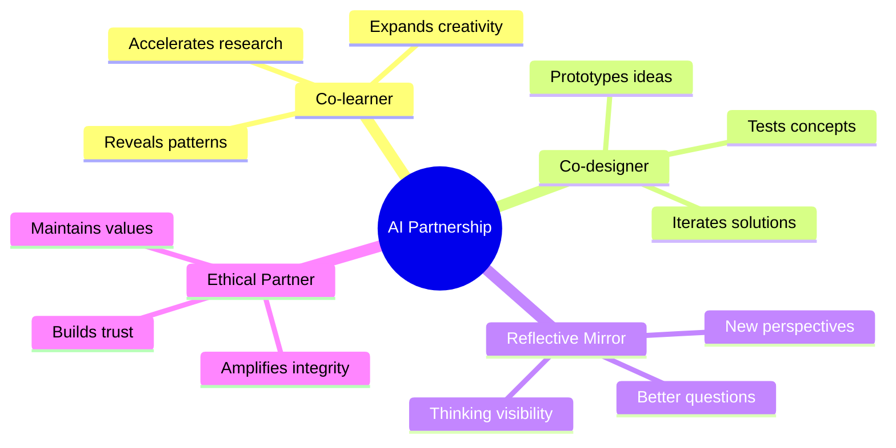
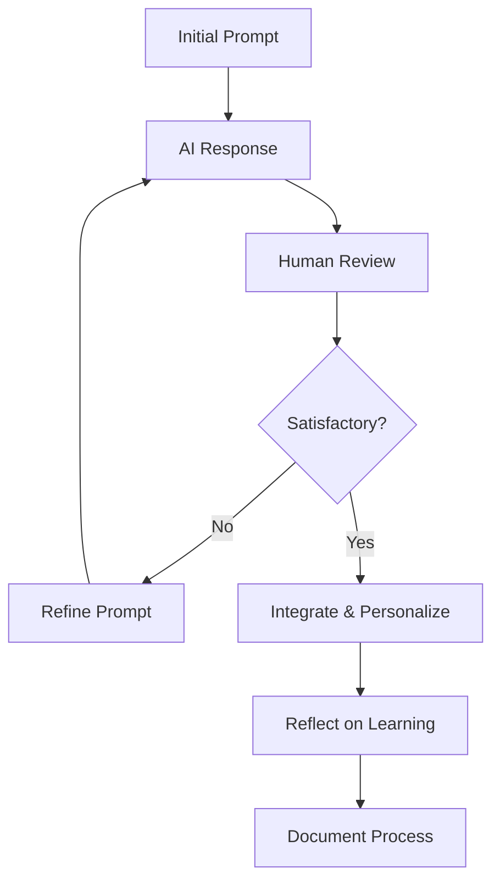
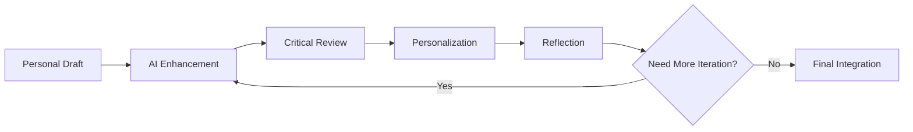
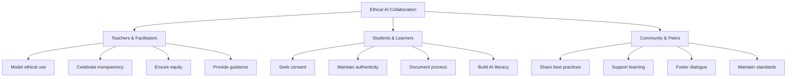

# 🤖 AI Collaboration Best Practices
[](https://github.com)
[](https://github.com)
[](https://github.com)
[](https://github.com)

> [!IMPORTANT]
> **"AI is not here to replace us. It's here to reveal us."**
> 
> *Every AI conversation is a reflection of your own becoming.* 🧚‍♂️

---

## 📋 Table of Contents
- [🧭 Why AI Collaboration?](#-why-ai-collaboration)
- [🌱 Core Principles](#-core-principles-of-human-ai-partnership)
- [🛠️ Effective Collaboration](#️-how-to-collaborate-effectively)
- [🤖 AI Capabilities](#-what-ai-can-do-in-these-projects)
- [📎 Documentation](#-collaboration-documentation)
- [🤝 Shared Responsibility](#-shared-responsibility)
- [🌍 Beyond the Classroom](#-beyond-the-classroom)
- [🎯 Quick Reference](#-quick-reference-guide)

---

## 🧭 Why AI Collaboration?



> [!NOTE]
> AI is not just a tool in this system—it's a **co-learner**, **co-designer**, and **reflective mirror**.

### 🚀 AI Helps Us:
- [x] 🔍 Accelerate research and prototyping
- [x] 🎨 Expand creativity and perspective  
- [x] ❓ Ask better questions—not just get better answers
- [x] 🪞 See our thinking from new angles
- [x] 🧠 Develop meta-cognitive awareness

> [!WARNING]
> **But to co-create meaningfully with AI, we need care, clarity, and a shared set of values.**

---

## 🌱 Core Principles of Human-AI Partnership

<details>
<summary><strong>🔍 1. Transparency</strong></summary>

**Always let others know when AI contributed. Honesty strengthens trust and collaboration.**

**Implementation:**
- Include AI collaboration notes in project documentation
- Use clear markers in collaborative documents
- Share prompts and AI responses when relevant
- Model transparency in all interactions

> [!TIP]
> **Example Transparency Statement:**  
> *"This section was brainstormed with AI assistance to explore multiple perspectives."*

</details>

<details>
<summary><strong>🏷️ 2. Attribution</strong></summary>

**Acknowledge which parts were AI-assisted and which were authored by humans. Credit both.**

**Best Practices:**
```yaml
Attribution Framework:
  Human Contributions:
    - Original ideas and insights
    - Personal experiences and perspectives
    - Critical analysis and evaluation
    - Final decisions and judgments
  
  AI Contributions:
    - Research synthesis
    - Structure suggestions
    - Alternative perspectives
    - Language refinement
  
  Collaborative Elements:
    - Iterative idea development
    - Problem-solving dialogue
    - Creative brainstorming
    - Quality improvement cycles
```

</details>

<details>
<summary><strong>🤝 3. Consent & Co-agency</strong></summary>

**AI should never be used to write *for* someone without their knowledge. Always get consent in group work.**

> [!CAUTION]
> **Before Using AI in Group Projects:**
> - Ask team members for explicit consent
> - Discuss boundaries and comfort levels
> - Establish group AI use guidelines
> - Ensure everyone has access to AI tools

**Consent Checklist:**
- [ ] Team members aware of AI use
- [ ] Boundaries clearly established
- [ ] Access equity ensured
- [ ] Attribution methods agreed upon

</details>

<details>
<summary><strong>🔄 4. Iterative Dialogue</strong></summary>

**Treat AI like a thinking partner. Don't stop at the first output—revise, question, co-shape.**



**Dialogue Quality Indicators:**
- Multiple prompt iterations
- Questions asked to AI
- Challenging AI responses
- Personalizing AI outputs
- Learning documentation

</details>

<details>
<summary><strong>⚖️ 5. Ethical Boundaries</strong></summary>

> [!DANGER]
> **Avoid These Practices:**
> - Using AI to plagiarize academic work
> - Generating harmful or biased content
> - Over-relying on AI without critical thinking
> - Bypassing learning processes
> - Creating deceptive content

**We use AI to amplify integrity, not bypass it.**

**Ethical Framework:**
| Scenario | ✅ Ethical | ❌ Problematic |
|----------|------------|----------------|
| **Research** | AI helps find sources, you verify and analyze | AI writes your research paper |
| **Writing** | AI suggests improvements, you maintain voice | AI writes in your voice without disclosure |
| **Problem Solving** | AI offers perspectives, you make decisions | AI makes decisions for you |
| **Creativity** | AI sparks ideas, you develop them | AI creates final work without your input |

</details>

---

## 🛠️ How to Collaborate Effectively

### 🎯 Prompt Engineering Excellence

<details>
<summary><strong>✅ Good Prompts</strong></summary>

**Structure-Focused:**
- *"Can you help me structure this idea about renewable energy policy?"*
- *"What's the most logical way to organize these research findings?"*

**Perspective-Expanding:**
- *"What perspectives am I missing in this climate change analysis?"*
- *"How would different stakeholders view this solution?"*

**Audience-Adaptation:**
- *"Give me 3 ways to reframe this story for different audiences."*
- *"How can I explain quantum computing to middle school students?"*

**Critical Analysis:**
- *"What are the weaknesses in this argument?"*
- *"What questions should I be asking about this data?"*

</details>

<details>
<summary><strong>🔁 Revision Cycles</strong></summary>



**Step-by-Step Process:**
1. **🧠 Draft your own thoughts first** (even rough notes)
2. **🤖 Ask AI to expand, refine, or contrast** with specific prompts
3. **✏️ Edit the AI's response** to re-personalize and align with your voice
4. **🤔 Reflect:** *What did I learn from this interaction?*
5. **📝 Document the collaboration** for transparency and learning

</details>

<details>
<summary><strong>🎭 Personalization Techniques</strong></summary>

**Role Definition:**
- *"Act as a sustainability advisor reviewing my climate action plan."*
- *"Respond as a friendly peer giving feedback on my presentation."*

**Tone & Style Guidance:**
- *"Make it hopeful and concise for a youth audience."*
- *"Use academic language appropriate for a research proposal."*
- *"Help me sound more conversational and accessible."*

**Context Setting:**
- *"I'm a high school student explaining photosynthesis to elementary kids."*
- *"This is for a community presentation about local food systems."*

> [!TIP]
> **Advanced Personalization:**
> Share your writing samples or preferred style guides with AI to maintain consistency across projects.

</details>

---

## 🤖 What AI Can Do in These Projects

### 📊 Capability Matrix

| Capability | Strength Level | Example Applications | Best Prompts |
|------------|----------------|---------------------|--------------|
| **🔍 Research Support** | ⭐⭐⭐⭐⭐ | Literature reviews, data synthesis | *"Summarize current climate adaptation methods in coastal cities."* |
| **🎨 Creative Ideation** | ⭐⭐⭐⭐⭐ | Story angles, design concepts | *"Suggest narrative angles for a documentary on food waste."* |
| **📏 Rubric Alignment** | ⭐⭐⭐⭐ | Self-assessment, quality checks | *"How does this writing meet the storytelling rubric criteria?"* |
| **👥 Peer Simulation** | ⭐⭐⭐⭐ | Feedback, perspective-taking | *"Give constructive feedback on my project outline."* |
| **🌐 Translation & Access** | ⭐⭐⭐⭐⭐ | Language support, accessibility | *"Translate this section for a Spanish-speaking audience."* |
| **🎭 Role Simulation** | ⭐⭐⭐⭐ | Expert feedback, scenario testing | *"Act as a city planner reviewing this resilience plan."* |

<details>
<summary><strong>🔍 Research & Analysis</strong></summary>

**Powerful for:**
- Synthesizing complex information
- Finding patterns across sources
- Generating research questions
- Creating literature summaries

**Sample Prompts:**
```
"Analyze these three climate studies and identify common themes."
"What are the top 5 questions researchers are asking about renewable energy?"
"Help me find gaps in current understanding of urban sustainability."
```

</details>

<details>
<summary><strong>🎨 Creative & Design Support</strong></summary>

**Excellent for:**
- Brainstorming creative approaches
- Generating multiple perspectives
- Refining artistic concepts
- Developing narrative structures

**Sample Prompts:**
```
"Generate 10 metaphors for explaining how ecosystems function."
"What visual storytelling techniques work best for environmental documentaries?"
"Help me develop characters for a climate fiction story."
```

</details>

<details>
<summary><strong>📈 Quality & Assessment</strong></summary>

**Useful for:**
- Self-assessment against rubrics
- Identifying improvement areas
- Checking for bias or gaps
- Enhancing clarity and flow

**Sample Prompts:**
```
"Rate this presentation against our collaboration rubric."
"What questions would a skeptical audience ask about this proposal?"
"How can I make this more accessible to diverse learners?"
```

</details>

---

## 📎 Collaboration Documentation

> [!IMPORTANT]
> **Transparency builds trust and enhances learning for everyone.**

### 📝 AI Collaboration Statement Template

<details>
<summary><strong>📋 Documentation Templates</strong></summary>

**For Individual Projects:**
> *"Parts of this [project type] were supported by AI prompts related to [specific areas: structure/research/clarity]. All [research/analysis/conclusions] were fact-checked and personalized by [me/our team]. AI contributed approximately [X%] to the initial drafting, with [Y%] being human revision and personalization."*

**For Group Projects:**
> *"Our team used AI collaboration for [specific tasks] with full consent from all members. Each team member took responsibility for [specific sections]. AI suggestions were critically evaluated and modified to align with our shared vision and individual voices."*

**For Creative Works:**
> *"AI tools assisted with [brainstorming/visual generation/editing] while maintaining human authorship of [core concepts/personal experiences/final decisions]. The creative vision and emotional authenticity remain entirely human-driven."*

</details>

### 📊 Collaboration Tracking

| Project Phase | Human Contribution | AI Contribution | Collaboration Quality |
|---------------|-------------------|-----------------|---------------------|
| **Research** | Topic selection, source evaluation | Information synthesis, pattern identification | ⭐⭐⭐⭐ |
| **Planning** | Goal setting, timeline creation | Structure suggestions, milestone ideas | ⭐⭐⭐⭐⭐ |
| **Creation** | Original ideas, personal voice | Language refinement, alternative approaches | ⭐⭐⭐⭐ |
| **Revision** | Final decisions, value alignment | Grammar, clarity, consistency checks | ⭐⭐⭐⭐⭐ |

---

## 🤝 Shared Responsibility



<details>
<summary><strong>👨‍🏫 Teachers & Facilitators Should</strong></summary>

**Modeling Excellence:**
- [ ] Demonstrate ethical AI use in lesson planning and feedback
- [ ] Share their own AI collaboration experiences
- [ ] Acknowledge when AI assists their teaching preparation
- [ ] Show both successful and challenging AI interactions

**Creating Supportive Environment:**
- [ ] Celebrate thoughtful, transparent AI collaboration
- [ ] Provide scaffolding for AI literacy development
- [ ] Address AI anxiety and misconceptions
- [ ] Foster critical thinking about AI capabilities and limitations

**Ensuring Equity:**
- [ ] Ensure equal access to AI tools across all students
- [ ] Provide alternative pathways for non-AI approaches
- [ ] Address digital divide and resource disparities
- [ ] Support diverse learning preferences and styles

</details>

<details>
<summary><strong>🎓 Students & Learners Should</strong></summary>

**Building Collaborative Skills:**
- [ ] Ask before using AI in group work
- [ ] Be ready to explain personal vs. AI contributions
- [ ] Develop ongoing relationships with AI tools, not just copy-paste
- [ ] Practice iterative dialogue and critical evaluation

**Maintaining Authenticity:**
- [ ] Preserve personal voice and perspective
- [ ] Take ownership of final decisions and outputs
- [ ] Reflect on learning gained through AI collaboration
- [ ] Share honest experiences with successes and challenges

**Growing AI Literacy:**
- [ ] Understand AI capabilities and limitations
- [ ] Develop prompt engineering skills
- [ ] Learn to evaluate AI-generated content critically
- [ ] Explore ethical implications of AI use

</details>

---

## 🌍 Beyond the Classroom

> [!SUCCESS]
> **AI co-creation is a new literacy that prepares students for the future.**

### 🚀 Future-Ready Skills

<details>
<summary><strong>🧠 Cognitive Capabilities</strong></summary>

**Complexity Navigation:**
- Managing information overload
- Synthesizing diverse perspectives
- Making decisions with incomplete information
- Adapting to rapid technological change

**Bias Recognition:**
- Identifying AI bias and limitations
- Understanding human cognitive biases
- Developing cultural competency
- Promoting inclusive thinking

</details>

<details>
<summary><strong>🤝 Social & Emotional Intelligence</strong></summary>

**Communication Excellence:**
- Using language as a bridge, not a weapon
- Facilitating human-AI-human dialogue
- Building trust in hybrid work environments
- Negotiating ethical boundaries

**Collaborative Leadership:**
- Leading diverse human-AI teams
- Mediating between different perspectives
- Building consensus across stakeholder groups
- Fostering innovation through collaboration

</details>

<details>
<summary><strong>🌱 Ethical Development</strong></summary>

**Responsibility & Accountability:**
- Taking ownership of AI-assisted work
- Making ethical decisions under uncertainty
- Balancing efficiency with authenticity
- Contributing to beneficial AI development

</details>

### 💼 Professional Applications

| Industry | AI Collaboration Skills | Career Impact |
|----------|------------------------|---------------|
| **Education** | Personalized learning design, curriculum development | Enhanced teaching effectiveness |
| **Healthcare** | Diagnostic assistance, patient communication | Improved care quality and efficiency |
| **Creative Arts** | Ideation support, technical assistance | Expanded creative possibilities |
| **Business** | Strategic analysis, customer insights | Data-driven decision making |
| **Research** | Literature synthesis, hypothesis generation | Accelerated discovery and innovation |

---

## 🎯 Quick Reference Guide

<details>
<summary><strong>⚡ Quick Start Checklist</strong></summary>

**Before Starting AI Collaboration:**
- [ ] Define your learning objectives
- [ ] Choose appropriate AI tools
- [ ] Set ethical boundaries
- [ ] Plan documentation approach

**During Collaboration:**
- [ ] Start with your own ideas
- [ ] Use specific, context-rich prompts
- [ ] Question and iterate on AI responses
- [ ] Maintain your authentic voice

**After Collaboration:**
- [ ] Document the process transparently
- [ ] Reflect on learning gains
- [ ] Share insights with peers
- [ ] Plan next collaboration improvements

</details>

<details>
<summary><strong>🚨 Common Pitfalls to Avoid</strong></summary>

> [!WARNING]
> **Red Flags:**
> - Accepting first AI response without iteration
> - Losing your personal voice in the output
> - Skipping transparency in group work
> - Over-relying on AI for critical thinking
> - Ignoring bias in AI responses
> - Failing to verify factual claims

</details>

<details>
<summary><strong>🎪 Advanced Techniques</strong></summary>

**Prompt Chaining:**
```
1. "Analyze this problem from multiple perspectives"
2. "Now critique each perspective for potential biases"
3. "Synthesize the strongest elements into a balanced approach"
4. "Help me identify what's missing from this synthesis"
```

**Role-Playing Dialogues:**
```
"Let's have a debate about renewable energy policy. You play the role of 
an economist, and I'll represent environmental activists. Present your 
strongest arguments, and I'll respond with counterpoints."
```

**Meta-Cognitive Questioning:**
```
"Reflect on our collaboration process. What worked well? What could be 
improved? How did working together change both of our thinking?"
```

</details>

---

## ✨ Final Thought

> [!QUOTE]
> When you collaborate with AI:
> 
> You're not just finishing a project.  
> You're **training the next intelligence** in how to think ethically, creatively, and cooperatively.
> 
> **Use that gift wisely.**

<div align="center">

### 🧠 The Meta-Learning Question

**"What did I learn about learning by working with AI?"**

---

### 🚀 **Remember:** Learning with AI is not about faster answers—it's about **deeper dialogue**.

[](https://github.com)
[](https://github.com)
[](https://github.com)

*"The most powerful learning happens at the intersection of human wisdom and artificial intelligence."*

</div>

---

<details>
<summary><strong>📚 Additional Resources</strong></summary>

### 🔗 **Recommended Tools:**
- **Claude (Anthropic)** - Thoughtful dialogue and analysis
- **ChatGPT (OpenAI)** - Creative brainstorming and writing
- **GitHub Copilot** - Code collaboration and documentation
- **Notion AI** - Note-taking and organization

### 📖 **Further Reading:**
- AI Ethics guidelines from your institution
- Prompt engineering best practices
- Human-AI collaboration research
- Digital literacy frameworks

### 🎥 **Learning Resources:**
- AI collaboration workshops
- Peer sharing sessions
- Expert guest speakers
- Cross-disciplinary case studies

</details>

<details>
<summary><strong>📝 Document Information</strong></summary>

- **Version:** 3.0 Enhanced
- **Last Updated:** August 2025
- **Contributors:** Educators, Students, AI Ethics Experts
- **License:** ## 🔒 License and Anti-Commercialization Protection Framework

### Comprehensive Intellectual Property Protection

This educational platform operates under the GNU Affero General Public License version 3 with additional ethical use restrictions that prevent commercial exploitation while ensuring maximum accessibility for educational communities worldwide. Our licensing framework represents the most aggressive anti-commercialization protection available under international law, designed specifically to prevent intellectual property theft and unauthorized commercial capture of community-developed educational resources.

The licensing structure ensures that any commercial entity attempting to use this platform must comply fully with copyleft requirements that mandate public release of all derivative works, modifications, and related implementations under identical licensing terms. This framework creates substantial barriers to commercial exploitation while maintaining complete accessibility for legitimate educational applications.

### Commercial Use Prohibition and Legal Consequences

Commercial entities may not use this educational platform without demonstrating full compliance with GNU Affero General Public License version 3 copyleft requirements and ethical use restrictions. Violations result in immediate license termination and comprehensive legal enforcement designed to impose maximum available penalties while recovering community resources through mandatory public release of violator improvements and proprietary implementations.

Our legal enforcement strategy prioritizes outcomes that benefit the educational community through aggressive pursuit of statutory damages, injunctive relief preventing continued violations, comprehensive recovery of legal fees and enforcement costs, and mandatory disclosure of violating entity identities and business practices.

### Ethical Use Requirements and Community Protection

This platform may not be used by entities engaged in environmental harm, human rights violations, or extractive business practices that contradict our planetary restoration mission and community values. Ethical use restrictions specifically prohibit adoption by fossil fuel companies, organizations with documented environmental violations, entities that discriminate against protected groups, and commercial platforms that restrict educator or student access to educational resources.

Community protection measures ensure that collaborative educational development remains permanently accessible to educators and students while preventing commercial entities from privatizing innovations developed through community investment and collaborative effort.

### Active Monitoring and Violation Detection

We implement comprehensive monitoring systems designed to identify license violations and intellectual property theft across all digital platforms and commercial marketplaces. Detection capabilities include automated analysis of repository forks and derivatives for unauthorized commercial implementations, continuous surveillance of educational technology markets for proprietary versions of our platform, and community-driven reporting mechanisms that enable educators worldwide to identify and report potential violations.

Technical monitoring systems operate continuously to protect community interests, with particular attention to commercial entities attempting to rebrand or restructure our educational framework for proprietary commercial use without proper licensing compliance.

### Enforcement Commitment and Community Support

We maintain dedicated legal resources specifically allocated for intellectual property enforcement and license violation response. Our enforcement philosophy emphasizes maximum available legal penalties against violators, comprehensive public disclosure of all violations and enforcement actions, aggressive pursuit of remedies that benefit the educational community, and financial recovery that supports continued platform development and community protection activities.

Community support includes legal consultation for educators facing pressure from commercial entities, coordination of collective response to significant violations, and comprehensive documentation of enforcement actions that educates the broader educational community about intellectual property protection in collaborative educational development.

### Reporting Violations and Community Engagement

Educational community members can report suspected license violations or intellectual property theft through established channels that ensure prompt investigation and appropriate legal response. Violation reports should include complete entity identification and evidence of unauthorized commercial use, with particular attention to commercial platforms claiming ownership of community-developed educational content or implementing proprietary versions without proper attribution and licensing compliance.

Community engagement in violation detection and reporting provides essential protection for collaborative educational development while ensuring that commercial entities understand the serious legal consequences of attempting to privatize community-developed educational resources.

**Primary Legal Contact:** legal@planetaryrestorationarchive.org  
**Community Violation Reporting:** violations@planetaryrestorationarchive.org  
**Licensing Compliance Questions:** compliance@planetaryrestorationarchive.org

### International Protection and Cross-Border Enforcement

Intellectual property protection extends globally through established legal cooperation mechanisms and partner networks in major jurisdictions worldwide. Cross-border enforcement capabilities ensure that commercial entities face legal consequences regardless of their operational headquarters or corporate domicile, with particular emphasis on jurisdictions that provide strong protection for educational resources and collaborative development.

International enforcement coordination includes utilization of intellectual property treaties and diplomatic channels, strategic forum selection for maximum legal impact, and comprehensive documentation that supports enforcement actions across multiple jurisdictions simultaneously.

### Community Benefits and Resource Recovery

Our enforcement framework ensures that license violations ultimately benefit the educational community through recovery of innovations and improvements that commercial entities developed through unauthorized use of our platform. Violation consequences include automatic public domain release of violator improvements and derivative works, community access to enhanced educational features and technical innovations, and financial settlements that fund continued platform development and community protection activities.

Legal outcomes prioritize educational community benefit over purely punitive measures, ensuring that enforcement actions contribute to long-term platform sustainability and enhanced educational accessibility rather than merely imposing penalties on violating entities.

---

**This educational platform is permanently protected from commercial exploitation through comprehensive legal mechanisms that ensure enduring community benefit and educational accessibility.**

*For complete licensing terms, see the LICENSE and LICENSE-ETHICAL-RESTRICTIONS files in this repository.*

---
- **Next Review:** Semester-end with learning community feedback

**Change Log:**
- v3.0: Added interactive elements, advanced techniques, professional applications
- v2.0: Enhanced ethical framework, improved documentation templates
- v1.0: Initial best practices framework

</details>