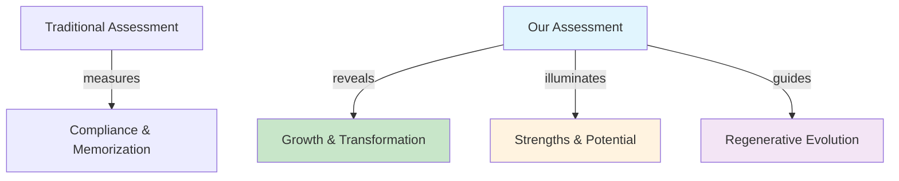
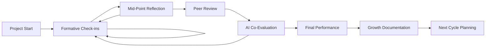

# 🎓 Assessment Philosophy
[](https://github.com)
[](https://github.com)
[](https://github.com)

> [!IMPORTANT]
> **"We don't measure compliance. We reveal growth."**
> 
> *Assessment is the science of becoming.* 🧬

---

## 📋 Table of Contents
- [🌱 Purpose](#-purpose-of-assessment-in-this-system)
- [🔍 Guiding Principles](#-guiding-principles)
- [📊 Assessment Types](#-types-of-assessment-used)
- [🤖 AI Integration](#-ais-role-in-assessment)
- [🧰 Rubric System](#-the-rubric-system)
- [🌍 Regenerative Practice](#-regenerative-assessment-in-action)
- [✨ Implementation](#-implementation-guide)

---

## 🌱 Purpose of Assessment in This System



> [!NOTE]
> **Assessment is not the end—it's part of the learning.**  
> It exists to *reveal progress*, *illuminate strengths*, and *guide regenerative evolution* of both learners and systems.

### What We Assess ✅
- [x] 🤔 Curiosity and critical thinking
- [x] 🎨 Creative risk-taking  
- [x] 🤝 Collaboration with peers and AI
- [x] 🌐 Real-world application and systems thinking
- [x] ❤️ Emotional and ethical insight

---

## 🔍 Guiding Principles

<details>
<summary><strong>🌟 1. Holistic, Not Just Academic</strong></summary>

We value *personal growth*, *team contribution*, and *planetary alignment* as much as polished deliverables.

**Evidence might include:**
- Peer testimonials about collaboration
- Documentation of community impact
- Reflection on personal development
- Environmental consideration in projects

</details>

<details>
<summary><strong>🔄 2. Process Over Product</strong></summary>

We reward learning from mistakes, adapting, and iteration—especially when students document their process openly.

**This looks like:**
- Documented iteration cycles
- Reflection on failures and pivots
- Public sharing of learning journey
- Transparent problem-solving approaches

</details>

<details>
<summary><strong>📈 3. Growth is Relative, Not Ranked</strong></summary>

Each learner is evaluated against **their own growth**, not against others. Rubrics are designed to support self-comparison over time.

> [!TIP]
> **Personal Growth Metrics:**
> - Week 1 vs Week 10 comparison
> - Skill development trajectory  
> - Confidence and autonomy increases
> - Learning velocity and depth

</details>

<details>
<summary><strong>💬 4. Assessment Is Dialogical</strong></summary>

Teachers, students, and even AI agents are co-evaluators. Reflection, feedback loops, and mutual check-ins are built into each project.

**Feedback Sources:**
```
Student ←→ Teacher ←→ AI Agent
    ↕️         ↕️        ↕️
   Peer    Community  Mentor
```

</details>

<details>
<summary><strong>🗺️ 5. Rubrics Are Maps, Not Fences</strong></summary>

We offer flexible rubrics tailored to each project type. They are scaffolds for reflection—not rigid scorecards.

> [!WARNING]
> **Avoid:** Using rubrics as gatekeepers  
> **Embrace:** Using rubrics as growth guides

</details>

---

## 📊 Types of Assessment Used

| Type | Icon | Description | Frequency | Tools |
|------|------|-------------|-----------|-------|
| **Formative** | 🌟 | Ongoing feedback from teachers, peers, and AI. Encourages iteration. | Daily/Weekly | Comments, Voice notes, AI prompts |
| **Reflective** | 📘 | Student journals, voice memos, and AI reflections captured mid-journey. | Weekly | Digital journals, Audio logs |
| **Self/Peer Review** | 🧭 | Used to build metacognition and emotional intelligence. | Bi-weekly | Structured forms, Peer circles |
| **Performance-Based** | 🛠️ | Final public-facing product, presentation, or implementation. | End of cycle | Presentations, Demos, Publications |
| **Co-Evaluation with AI** | 💡 | Prompts like "How did I improve this week?" used with GPT or Claude | Ongoing | AI reflection tools |

### Assessment Flow Diagram



---

## 🤖 AI's Role in Assessment

> [!IMPORTANT]
> AI agents serve as **mirrors**, **coaches**, and **editors**—never judges.

<details>
<summary><strong>🪞 AI as Mirror</strong></summary>

**Reflection Prompts:**
- *"What part of your project are you most proud of?"*
- *"Where did you surprise yourself this week?"*
- *"What would you do differently if you started over?"*

</details>

<details>
<summary><strong>🏃‍♂️ AI as Coach</strong></summary>

**Development Support:**
- Suggest personalized next steps
- Identify learning patterns
- Recommend resources based on interests
- Help set appropriate challenges

</details>

<details>
<summary><strong>✏️ AI as Editor</strong></summary>

**Quality Enhancement:**
- Tone, clarity, and coherence checks
- Grammar and style suggestions
- Argument structure analysis
- Citation and source verification

</details>

> [!NOTE]
> **Most importantly—they help learners see themselves more clearly.** 🔍

---

## 🧰 The Rubric System

### Dynamic Rubric Features

```yaml
Rubric Components:
  Domain Specific: 
    - Scientific inquiry skills
    - Civic engagement depth
    - Creative expression range
  
  Universal Elements:
    - Collaboration quality
    - Ethical reasoning
    - Systems thinking
    - Communication clarity
  
  Growth Dimensions:
    - Autonomy development
    - Risk-taking evolution
    - Reflection sophistication
```

<details>
<summary><strong>📋 Sample Rubric Structure</strong></summary>

| Dimension | Emerging 🌱 | Developing 🌿 | Proficient 🌳 | Transformative 🌟 |
|-----------|-------------|----------------|----------------|-------------------|
| **Critical Thinking** | Asks basic questions | Questions assumptions | Synthesizes multiple perspectives | Generates novel frameworks |
| **Collaboration** | Participates in group | Contributes meaningfully | Facilitates others' growth | Transforms group dynamics |
| **Impact** | Personal learning | Peer influence | Community benefit | Systems change |

</details>

### Rubric Principles ✨

- [x] **Transparent** from day one
- [x] **Co-created** with learners when possible  
- [x] **Evolutionary** - designed to grow with the learner
- [x] **Multi-dimensional** - capturing various aspects of growth
- [x] **Future-focused** - preparing for unknown challenges

---

## 🌍 Regenerative Assessment in Action

> [!SUCCESS]
> **Learners may be credited for:**

### Community Impact 🏘️
- Uplifting their community
- Organizing collaborative projects
- Mentoring younger learners
- Building inclusive spaces

### System Repair 🔧
- Fixing broken processes (physical or digital)
- Improving accessibility
- Optimizing workflows
- Healing relationships

### Life Enhancement 🌺
- Improving a living thing's condition (person, plant, place)
- Contributing to wellbeing
- Nurturing growth in others
- Environmental stewardship

### Leadership Evolution 👥
- Coordinating teams effectively
- Facilitating difficult conversations
- Building consensus
- Empowering others to lead

### Perspective Transformation 🔄
- Shifting their own worldview
- Helping others see differently
- Bridging diverse viewpoints
- Challenging harmful assumptions

---

## ✨ Implementation Guide

<details>
<summary><strong>🚀 Getting Started</strong></summary>

1. **Week 1-2:** Introduce philosophy and co-create rubrics
2. **Week 3:** Begin formative assessment practices
3. **Week 4:** Integrate AI reflection tools
4. **Ongoing:** Regular peer and self-assessment cycles

</details>

<details>
<summary><strong>🛠️ Tools & Resources</strong></summary>

### Digital Platforms
- GitHub for portfolio development
- Discord/Slack for peer feedback
- AI tools for reflection prompts
- Video tools for presentation documentation

### Assessment Artifacts
- Learning journals (digital/analog)
- Project documentation
- Peer feedback collections
- Growth timeline visualizations

</details>

<details>
<summary><strong>📈 Measuring Success</strong></summary>

**System-Level Indicators:**
- Increased student agency in learning
- Higher engagement in feedback processes  
- More sophisticated self-reflection
- Greater collaboration quality
- Enhanced real-world impact

</details>

---

## 🎯 Final Thought

> [!QUOTE]
> Assessment here is not about passing or failing.  
> It's about **witnessing transformation**.

We are not trying to fit children into an obsolete model of achievement.  
We are **inviting them to shape what achievement itself can mean**.

---

<div align="center">

### 🧬 *Assessment is the science of becoming.*

[](https://github.com)
[](https://github.com)

*"The future belongs to learners who can grow, adapt, and transform—not just achieve."*

</div>

---

<details>
<summary><strong>📝 Document Metadata</strong></summary>

- **Version:** 2.0
- **Last Updated:** August 2025
- **Contributors:** Educational Philosophers, Students, AI Collaborators
- **License:** ## 🔒 License and Anti-Commercialization Protection Framework

### Comprehensive Intellectual Property Protection

This educational platform operates under the GNU Affero General Public License version 3 with additional ethical use restrictions that prevent commercial exploitation while ensuring maximum accessibility for educational communities worldwide. Our licensing framework represents the most aggressive anti-commercialization protection available under international law, designed specifically to prevent intellectual property theft and unauthorized commercial capture of community-developed educational resources.

The licensing structure ensures that any commercial entity attempting to use this platform must comply fully with copyleft requirements that mandate public release of all derivative works, modifications, and related implementations under identical licensing terms. This framework creates substantial barriers to commercial exploitation while maintaining complete accessibility for legitimate educational applications.

### Commercial Use Prohibition and Legal Consequences

Commercial entities may not use this educational platform without demonstrating full compliance with GNU Affero General Public License version 3 copyleft requirements and ethical use restrictions. Violations result in immediate license termination and comprehensive legal enforcement designed to impose maximum available penalties while recovering community resources through mandatory public release of violator improvements and proprietary implementations.

Our legal enforcement strategy prioritizes outcomes that benefit the educational community through aggressive pursuit of statutory damages, injunctive relief preventing continued violations, comprehensive recovery of legal fees and enforcement costs, and mandatory disclosure of violating entity identities and business practices.

### Ethical Use Requirements and Community Protection

This platform may not be used by entities engaged in environmental harm, human rights violations, or extractive business practices that contradict our planetary restoration mission and community values. Ethical use restrictions specifically prohibit adoption by fossil fuel companies, organizations with documented environmental violations, entities that discriminate against protected groups, and commercial platforms that restrict educator or student access to educational resources.

Community protection measures ensure that collaborative educational development remains permanently accessible to educators and students while preventing commercial entities from privatizing innovations developed through community investment and collaborative effort.

### Active Monitoring and Violation Detection

We implement comprehensive monitoring systems designed to identify license violations and intellectual property theft across all digital platforms and commercial marketplaces. Detection capabilities include automated analysis of repository forks and derivatives for unauthorized commercial implementations, continuous surveillance of educational technology markets for proprietary versions of our platform, and community-driven reporting mechanisms that enable educators worldwide to identify and report potential violations.

Technical monitoring systems operate continuously to protect community interests, with particular attention to commercial entities attempting to rebrand or restructure our educational framework for proprietary commercial use without proper licensing compliance.

### Enforcement Commitment and Community Support

We maintain dedicated legal resources specifically allocated for intellectual property enforcement and license violation response. Our enforcement philosophy emphasizes maximum available legal penalties against violators, comprehensive public disclosure of all violations and enforcement actions, aggressive pursuit of remedies that benefit the educational community, and financial recovery that supports continued platform development and community protection activities.

Community support includes legal consultation for educators facing pressure from commercial entities, coordination of collective response to significant violations, and comprehensive documentation of enforcement actions that educates the broader educational community about intellectual property protection in collaborative educational development.

### Reporting Violations and Community Engagement

Educational community members can report suspected license violations or intellectual property theft through established channels that ensure prompt investigation and appropriate legal response. Violation reports should include complete entity identification and evidence of unauthorized commercial use, with particular attention to commercial platforms claiming ownership of community-developed educational content or implementing proprietary versions without proper attribution and licensing compliance.

Community engagement in violation detection and reporting provides essential protection for collaborative educational development while ensuring that commercial entities understand the serious legal consequences of attempting to privatize community-developed educational resources.

**Primary Legal Contact:** legal@planetaryrestorationarchive.org  
**Community Violation Reporting:** violations@planetaryrestorationarchive.org  
**Licensing Compliance Questions:** compliance@planetaryrestorationarchive.org

### International Protection and Cross-Border Enforcement

Intellectual property protection extends globally through established legal cooperation mechanisms and partner networks in major jurisdictions worldwide. Cross-border enforcement capabilities ensure that commercial entities face legal consequences regardless of their operational headquarters or corporate domicile, with particular emphasis on jurisdictions that provide strong protection for educational resources and collaborative development.

International enforcement coordination includes utilization of intellectual property treaties and diplomatic channels, strategic forum selection for maximum legal impact, and comprehensive documentation that supports enforcement actions across multiple jurisdictions simultaneously.

### Community Benefits and Resource Recovery

Our enforcement framework ensures that license violations ultimately benefit the educational community through recovery of innovations and improvements that commercial entities developed through unauthorized use of our platform. Violation consequences include automatic public domain release of violator improvements and derivative works, community access to enhanced educational features and technical innovations, and financial settlements that fund continued platform development and community protection activities.

Legal outcomes prioritize educational community benefit over purely punitive measures, ensuring that enforcement actions contribute to long-term platform sustainability and enhanced educational accessibility rather than merely imposing penalties on violating entities.

---

**This educational platform is permanently protected from commercial exploitation through comprehensive legal mechanisms that ensure enduring community benefit and educational accessibility.**

*For complete licensing terms, see the LICENSE and LICENSE-ETHICAL-RESTRICTIONS files in this repository.*

---
- **Next Review:** Quarterly with learning community

</details>