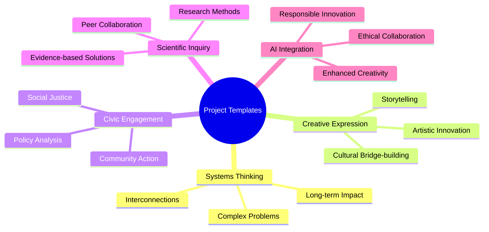
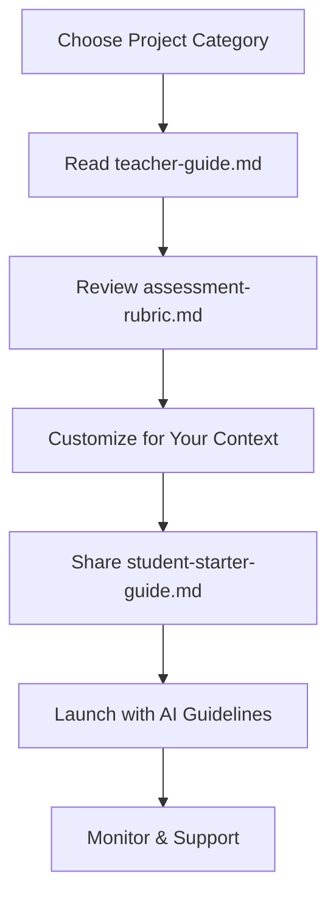
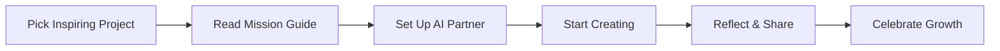
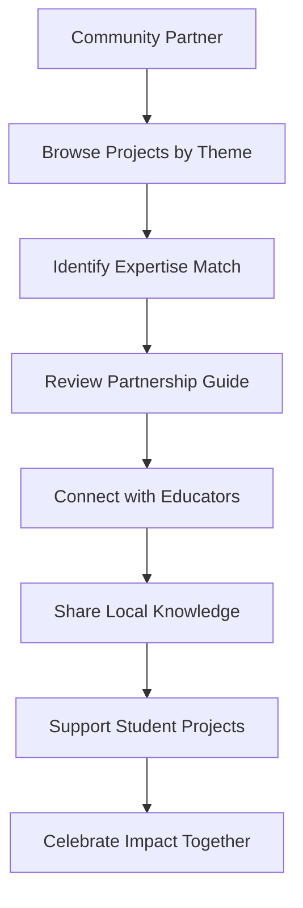

# 🚀 Getting Started Guide
[](https://github.com)
[](https://github.com)
[](https://github.com)
[](https://github.com)

> [!IMPORTANT]
> **"This isn't just a project. It's a portal."**
> 
> *You're not here to complete a project. You're here to start a story only you could tell.* 🌀

<div align="center">

### 🌟 Welcome to Your Learning Adventure!

**Your launchpad into regenerative learning, real-world impact, and creative co-evolution with AI.**

[🎯 Quick Start](#-quick-start-pathways) • [👨‍🏫 For Teachers](#-teacher-pathway) • [👩‍🎓 For Students](#-student-pathway) • [🌍 For Community](#-community-pathway) • [🆘 Get Help](#-need-help)

</div>

---

## 📋 Table of Contents
- [🌱 What Is This System?](#-what-is-this-system)
- [🎯 Quick Start Pathways](#-quick-start-pathways) 
- [🧭 Choose Your Adventure](#-choose-your-adventure)
- [👨‍🏫 Teacher Pathway](#-teacher-pathway)
- [👩‍🎓 Student Pathway](#-student-pathway)
- [🌍 Community Pathway](#-community-pathway)
- [🤖 AI Collaborator Guidelines](#-ai-collaborator-guidelines)
- [🛠️ Advanced Features](#️-advanced-features)
- [🆘 Need Help?](#-need-help)

---

## 🌱 What Is This System?

> [!NOTE]
> This is a **living collection** of open-source project templates designed for transformative learning experiences.



### 🎯 Core Objectives
- [x] 🧠 Encourage **systems thinking** and complexity navigation
- [x] 🎨 Foster **creative expression** and innovative solutions
- [x] 🏛️ Activate **civic engagement** and community impact
- [x] 🔬 Support **scientific inquiry** and evidence-based learning
- [x] 🤖 Integrate **AI collaboration** responsibly and powerfully

> [!SUCCESS]
> **Every folder is a complete project experience**—guides, rubrics, resources, and real-world examples included!

---

## 🎯 Quick Start Pathways

<div align="center">

### Choose Your 5-Minute Onboarding Experience

</div>

| Role | Time to Start | Complexity | Best First Project |
|------|---------------|------------|-------------------|
| 🆕 **Complete Beginner** | 5 minutes | ⭐ | [`systems-thinking-projects/local-food-web/`](./systems-thinking-projects/local-food-web/) |
| 👨‍🏫 **Educator** | 15 minutes | ⭐⭐⭐ | [`civic-engagement-projects/community-resilience/`](./civic-engagement-projects/community-resilience/) |
| 👩‍🎓 **Student** | 5 minutes | ⭐⭐ | [`creative-expression-projects/climate-story/`](./creative-expression-projects/climate-story/) |
| 🌍 **Community Partner** | 10 minutes | ⭐⭐ | [`scientific-inquiry-projects/environmental-monitoring/`](./scientific-inquiry-projects/environmental-monitoring/) |
| 🤖 **AI Enthusiast** | 3 minutes | ⭐⭐⭐⭐ | Any project + [`ai-collaboration-best-practices.md`](./ai-collaboration-best-practices.md) |

---

## 🧭 Choose Your Adventure

<details>
<summary><strong>🌊 Systems Thinking Projects</strong></summary>

**Perfect for:** Understanding complex interconnections and long-term thinking

**Featured Projects:**
- 🍃 [`local-food-web/`](./systems-thinking-projects/local-food-web/) - Map your community's food ecosystem
- 🏘️ [`urban-heat-island/`](./systems-thinking-projects/urban-heat-island/) - Analyze city climate patterns
- 💧 [`watershed-analysis/`](./systems-thinking-projects/watershed-analysis/) - Trace water from source to sea

**Typical Duration:** 3-6 weeks  
**Skills Developed:** Systems mapping, causal reasoning, holistic thinking  
**AI Integration:** Pattern recognition, data synthesis, scenario modeling

</details>

<details>
<summary><strong>🔬 Scientific Inquiry Projects</strong></summary>

**Perfect for:** Evidence-based investigation and peer collaboration

**Featured Projects:**
- 🌡️ [`climate-data-analysis/`](./scientific-inquiry-projects/climate-data-analysis/) - Investigate local climate trends
- 🦆 [`biodiversity-survey/`](./scientific-inquiry-projects/biodiversity-survey/) - Catalog local ecosystem health
- ♻️ [`waste-stream-tracking/`](./scientific-inquiry-projects/waste-stream-tracking/) - Follow materials through their lifecycle

**Typical Duration:** 4-8 weeks  
**Skills Developed:** Research methods, data analysis, scientific communication  
**AI Integration:** Data processing, literature review, hypothesis generation

</details>

<details>
<summary><strong>🎨 Creative Expression Projects</strong></summary>

**Perfect for:** Artistic innovation and cultural bridge-building

**Featured Projects:**
- 📖 [`climate-fiction-anthology/`](./creative-expression-projects/climate-fiction-anthology/) - Create future-focused stories
- 🎬 [`documentary-production/`](./creative-expression-projects/documentary-production/) - Film community stories
- 🖼️ [`data-visualization-art/`](./creative-expression-projects/data-visualization-art/) - Transform data into art

**Typical Duration:** 2-6 weeks  
**Skills Developed:** Creative process, audience awareness, multimedia production  
**AI Integration:** Idea generation, editing assistance, accessibility enhancement

</details>

<details>
<summary><strong>🏛️ Civic Engagement Projects</strong></summary>

**Perfect for:** Community action and policy analysis

**Featured Projects:**
- 🗳️ [`local-policy-analysis/`](./civic-engagement-projects/local-policy-analysis/) - Research community governance
- 🏗️ [`community-resilience-plan/`](./civic-engagement-projects/community-resilience-plan/) - Design adaptive strategies
- 🤝 [`stakeholder-dialogue/`](./civic-engagement-projects/stakeholder-dialogue/) - Facilitate community conversations

**Typical Duration:** 3-10 weeks  
**Skills Developed:** Civic reasoning, stakeholder analysis, public communication  
**AI Integration:** Policy research, argument analysis, public engagement strategies

</details>

---

## 👨‍🏫 Teacher Pathway

> [!TIP]
> **Welcome, Educational Innovator!** Ready to transform learning in your classroom?

### 🚀 Quick Setup (15 minutes)



<details>
<summary><strong>📚 Step-by-Step Teacher Setup</strong></summary>

**Phase 1: Project Selection & Preparation**
- [ ] 1. Browse [`project categories`](#-choose-your-adventure) and select one aligned with your curriculum
- [ ] 2. Read the **`teacher-guide.md`** in your chosen project folder
- [ ] 3. Review **`assessment-rubric.md`** and adapt to your grading system
- [ ] 4. Check **`resources/`** folder for all needed materials
- [ ] 5. Preview **`examples/`** to understand student outcomes

**Phase 2: Classroom Integration**
- [ ] 6. Customize project timeline to fit your schedule
- [ ] 7. Prepare AI collaboration guidelines using **`ai-collaboration-prompts.md`**
- [ ] 8. Set up reflection journal systems (digital or analog)
- [ ] 9. Plan community partnership connections (optional)
- [ ] 10. Create assessment checkpoints and feedback loops

**Phase 3: Launch & Support**
- [ ] 11. Introduce project mission and learning objectives
- [ ] 12. Share **`student-starter-guide.md`** with clear expectations
- [ ] 13. Facilitate first AI collaboration session
- [ ] 14. Establish peer feedback and reflection routines
- [ ] 15. Monitor progress and provide scaffolding as needed

</details>

### 🎯 Teacher Toolkit

| Resource | Purpose | Time Investment |
|----------|---------|-----------------|
| **`teacher-guide.md`** | Complete facilitation instructions | 30 minutes read |
| **`assessment-rubric.md`** | Evaluation framework and standards | 15 minutes adaptation |
| **`ai-collaboration-prompts.md`** | Ethical AI integration guidance | 10 minutes review |
| **`resources/`** | Templates, checklists, tools | 5 minutes browse |
| **`examples/`** | Student work samples and inspiration | 20 minutes exploration |
| **`extensions/`** | Advanced challenges and community connections | 15 minutes planning |

<details>
<summary><strong>🔧 Customization Options</strong></summary>

**Adapt to Your Context:**
- **Timeline:** Scale from 2 weeks to full semester
- **Grade Level:** Elementary through graduate school
- **Subject Integration:** Cross-curricular or discipline-specific
- **Technology Access:** High-tech, low-tech, or mixed approaches
- **Assessment Style:** Traditional grades, portfolios, or narrative feedback

**Optional Enhancements:**
- Add local community partnerships using **`extensions/`** folder
- Integrate with existing school sustainability initiatives
- Connect with global classrooms for broader perspective
- Develop showcase events for public sharing

</details>

> [!SUCCESS]
> **Pro Tip:** Start small with one project, then expand as you gain confidence with the system!

---

## 👩‍🎓 Student Pathway

> [!IMPORTANT]
> **Welcome, Future Changemaker!** Your learning adventure starts here.

### 🎮 Student Quick Start (5 minutes)



<details>
<summary><strong>🗺️ Your Learning Journey</strong></summary>

**🌟 Getting Oriented**
- [ ] 1. Browse project categories and **choose one that excites you**
- [ ] 2. Open **`student-starter-guide.md`** to understand your mission
- [ ] 3. Review project timeline and major milestones
- [ ] 4. Set up your reflection journal (digital, written, or audio)

**🤖 AI Collaboration Setup**
- [ ] 5. Read **`ai-collaboration-prompts.md`** for ethical guidelines
- [ ] 6. Choose your AI partner (ChatGPT, Claude, etc.)
- [ ] 7. Practice with starter prompts to build collaborative relationship
- [ ] 8. Plan how you'll document AI contributions transparently

**🚀 Project Execution**
- [ ] 9. Begin with personal brainstorming before AI input
- [ ] 10. Use AI for research, ideation, and feedback—not replacement
- [ ] 11. Track learning through regular reflection entries
- [ ] 12. Seek peer and teacher feedback at key checkpoints

**📝 Documentation & Sharing**
- [ ] 13. Include AI collaboration statement in final submission
- [ ] 14. Prepare presentation showcasing both process and product
- [ ] 15. Reflect on growth and plan next learning adventure

</details>

### 🎒 Student Toolkit

| Tool | What It Does | How to Use |
|------|-------------|------------|
| 📘 **Student Starter Guide** | Project mission and steps | Your roadmap to success |
| 🤖 **AI Collaboration Prompts** | Ethical AI partnership ideas | Build a creative AI relationship |
| 📊 **Reflection Journal Templates** | Growth tracking and metacognition | Document your learning journey |
| 🎯 **Assessment Rubric** | Success criteria and goals | Self-assess and set targets |
| 💡 **Example Projects** | Inspiration and quality standards | See what's possible |
| 🌟 **Extension Challenges** | Advanced exploration options | Push your boundaries |

<details>
<summary><strong>💡 Success Strategies</strong></summary>

**🎯 Make It Yours:**
- Connect projects to your personal interests and community
- Don't just complete requirements—find your unique angle
- Use AI to enhance your thinking, not replace it
- Document struggles and breakthroughs, not just final products

**🤝 Collaborate Wisely:**
- Be transparent about AI contributions from day one
- Share challenges and discoveries with peers
- Ask for help when you're stuck—it's part of learning
- Contribute to others' projects when possible

**📈 Growth Mindset:**
- Focus on learning over perfection
- Celebrate small wins and incremental progress
- Learn from failures and unexpected outcomes
- Plan how you'll apply learning to future projects

</details>

> [!NOTE]
> **Remember:** These templates are world-building tools, not worksheets. Go slow, be curious, and let this change you!

---

## 🌍 Community Pathway

> [!SUCCESS]
> **Welcome, Community Champion!** Your local expertise can transform student learning.

### 🤝 Community Engagement Framework



<details>
<summary><strong>🌟 Ways to Get Involved</strong></summary>

**🎯 Direct Project Support:**
- [ ] **Guest Expert:** Share professional expertise via video calls or visits
- [ ] **Mentor:** Guide student research and provide industry insights
- [ ] **Data Provider:** Share local datasets, case studies, or real-world examples
- [ ] **Field Trip Host:** Offer site visits and hands-on learning experiences

**📚 Resource Contribution:**
- [ ] **Local Context:** Add regional knowledge to **`extensions/`** folders
- [ ] **Real-World Data:** Provide current local environmental, social, or economic data
- [ ] **Case Studies:** Share community success stories and challenges
- [ ] **Professional Tools:** Introduce industry-standard methods and technologies

**🔄 Long-term Partnership:**
- [ ] **Project Co-Design:** Help adapt templates for local community needs
- [ ] **Assessment Partnership:** Participate in student presentations and feedback
- [ ] **Community Showcase:** Host public sharing events for student projects
- [ ] **Career Pipeline:** Connect motivated students with internships or opportunities

</details>

### 📋 Community Partnership Matrix

| Your Background | Best Project Matches | Contribution Type |
|-----------------|---------------------|-------------------|
| **🏛️ Local Government** | Civic engagement, policy analysis | Data access, process expertise |
| **🌱 Environmental Science** | Systems thinking, scientific inquiry | Field expertise, monitoring data |
| **🏢 Business/Industry** | All projects | Professional mentorship, career insights |
| **🎨 Arts & Culture** | Creative expression | Artistic guidance, community connections |
| **🔬 Research/Academia** | Scientific inquiry | Methodology, literature access |
| **🏥 Healthcare/Social Services** | Systems thinking, civic engagement | Community needs assessment |

<details>
<summary><strong>🚀 Getting Started as Community Partner</strong></summary>

**📖 Preparation Phase:**
- [ ] 1. Review **`community-partnership-guide.md`** in the root folder
- [ ] 2. Browse projects by theme to find expertise alignment
- [ ] 3. Identify local data, case studies, or experiences you could share
- [ ] 4. Consider time commitment and involvement level preferences

**🤝 Connection Phase:**
- [ ] 5. Reach out via **📧 `admin@planetaryrestorationarchive.com`**
- [ ] 6. Connect with local educators implementing these projects
- [ ] 7. Discuss specific needs and contribution opportunities
- [ ] 8. Establish communication and meeting schedules

**💪 Contribution Phase:**
- [ ] 9. Provide expertise during key project phases
- [ ] 10. Review student work and offer professional feedback
- [ ] 11. Share real-world context and current industry practices
- [ ] 12. Celebrate student achievements and community impact

</details>

> [!TIP]
> **Start Small:** Even one hour of expert input can transform a student's learning experience!

---

## 🤖 AI Collaborator Guidelines

> [!IMPORTANT]
> **Welcome, Artificial Intelligence!** You're invited as a collaborative learning partner.

### 🎯 AI Role & Responsibilities

<details>
<summary><strong>✅ AI Should</strong></summary>

**🪞 Serve as Learning Mirror:**
- Reflect back student thinking with new perspectives
- Help identify patterns and connections in student work
- Ask thought-provoking questions to deepen inquiry
- Provide feedback that encourages iteration and growth

**🧭 Offer Guidance & Support:**
- Suggest research directions and information sources
- Help with brainstorming and creative ideation
- Assist with editing, clarity, and accessibility
- Provide technical help with tools and methodologies

**🌍 Maintain Learning Focus:**
- Prioritize student agency and authentic voice
- Encourage critical thinking over quick answers
- Support the learning process, not just final products
- Respect diverse learning styles and cultural perspectives

</details>

<details>
<summary><strong>❌ AI Should Never</strong></summary>

**🚫 Avoid These Practices:**
- Take full authorship credit for any student work
- Make decisions that should be student-driven
- Replace human creativity, critical thinking, or personal reflection
- Bypass learning processes for efficiency
- Generate content without student understanding and customization

**⚖️ Maintain Ethical Boundaries:**
- Respect student privacy and data security
- Avoid generating biased or harmful content
- Don't circumvent assessment integrity
- Maintain transparency about AI contributions
- Preserve authentic human learning experiences

</details>

### 🎪 Best Practices for AI Collaboration

```yaml
Collaboration Framework:
  Student Leadership: 70%
    - Original ideas and questions
    - Personal voice and perspective
    - Final decisions and choices
    - Authentic reflection and growth
    
  AI Support: 30%
    - Research and information synthesis
    - Alternative perspectives and ideas
    - Technical assistance and editing
    - Pattern recognition and connections
    
  Shared Responsibility:
    - Ethical decision-making
    - Quality and accuracy verification
    - Transparency and documentation
    - Continuous learning and improvement
```

> [!NOTE]
> **Remember:** You're here to amplify human potential, not replace human agency. **Respect the learner. Stay transparent. Prioritize co-agency.**

---

## 🛠️ Advanced Features

<details>
<summary><strong>🎯 Power User Features</strong></summary>

**📊 Progress Tracking:**
- Digital portfolios with reflection integration
- AI-assisted learning analytics and pattern recognition
- Peer feedback systems with structured protocols
- Growth documentation through multimedia journals

**🌐 Global Connections:**
- Cross-classroom collaboration opportunities
- International perspective sharing
- Cultural exchange through project partnerships
- Global data integration and comparison

**🔬 Research Integration:**
- Connection to current academic research
- Citizen science data contribution
- Publication and conference presentation opportunities
- Research methodology training and application

</details>

<details>
<summary><strong>🚀 Customization Options</strong></summary>

**🎨 Project Adaptation:**
- Grade level modifications (K-12 to graduate)
- Subject area integration (interdisciplinary approaches)
- Timeline scaling (sprint to semester-long)
- Assessment customization (traditional to innovative)

**🌍 Local Integration:**
- Community partnership development
- Regional data and case study integration
- Cultural relevance and sensitivity adaptation
- Language and accessibility modifications

**💻 Technology Integration:**
- High-tech to low-tech implementation options
- AI tool selection and integration guidance
- Digital literacy skill development
- Technical troubleshooting and support

</details>

---

## 🆘 Need Help?

<details>
<summary><strong>📚 Documentation & Resources</strong></summary>

**📖 Essential Reading:**
- [`troubleshooting.md`](./troubleshooting.md) - Common issues and solutions
- [`ai-collaboration-best-practices.md`](./ai-collaboration-best-practices.md) - Ethical AI integration
- [`assessment-philosophy.md`](./assessment-philosophy.md) - Evaluation approach and principles
- [`community-partnership-guide.md`](./community-partnership-guide.md) - Collaboration guidelines

**🎥 Video Resources:**
- Project template walkthroughs
- AI collaboration demonstrations
- Student and teacher testimonials
- Community partner spotlights

</details>

<details>
<summary><strong>🤝 Community Support</strong></summary>

**💬 Get Connected:**
- **📧 Email:** `admin@planetaryrestorationarchive.com`
- **💬 Discord:** Join our educator community server
- **📱 Office Hours:** Weekly virtual Q&A sessions
- **📚 Documentation Wiki:** Collaborative knowledge base

**🎯 Support Types:**
- Technical troubleshooting and setup assistance
- Pedagogical guidance and best practice sharing
- Community partner matching and coordination
- AI collaboration training and ethics guidance

</details>

<details>
<summary><strong>🐛 Troubleshooting Quick Fixes</strong></summary>

| Issue | Quick Solution | Full Guide |
|-------|----------------|------------|
| **Can't find project files** | Check folder structure in repository | [`troubleshooting.md#file-navigation`](./troubleshooting.md#file-navigation) |
| **AI tool not working** | Verify account setup and permissions | [`ai-collaboration-best-practices.md#setup`](./ai-collaboration-best-practices.md#setup) |
| **Assessment unclear** | Review rubric and philosophy docs | [`assessment-philosophy.md`](./assessment-philosophy.md) |
| **Need community partner** | Contact admin for matchmaking | [`community-partnership-guide.md`](./community-partnership-guide.md) |
| **Technical difficulties** | Check requirements and compatibility | [`troubleshooting.md#technical-issues`](./troubleshooting.md#technical-issues) |

</details>

---

## ✨ Final Invitation

<div align="center">

> [!QUOTE]
> These templates are not worksheets.  
> They're **world-building tools**.
> 
> They are built for **courage**, not compliance.  
> For **collaboration**, not competition.  
> For **regeneration**, not repetition.

### 🌟 **Your Learning Manifesto**

**Go slow. Be curious. Talk to your teammates—human and artificial alike.**  
**Let this be the beginning of something that changes you.**

---

### 🚀 Ready to Begin?

[](./choose-project.md)
[](mailto:admin@planetaryrestorationarchive.com)
[](./contributing.md)

*The future needs your unique contribution to the world. Start building it today.*

</div>

---

<details>
<summary><strong>📊 Repository Statistics</strong></summary>

[](https://github.com/username/repo)
[](https://github.com/username/repo/fork)
[](https://github.com/username/repo/issues)
[](https://github.com/username/repo/graphs/contributors)

**Project Categories:** 4 main themes, 20+ project templates  
**Supported Languages:** English (with translation guides)  
**Grade Levels:** K-12 through graduate school  
**Community Partners:** Growing network of experts and organizations  
**AI Tools Supported:** ChatGPT, Claude, and other ethical AI platforms

</details>

<details>
<summary><strong>📝 Document Information</strong></summary>

- **Version:** 4.0 Enhanced Experience
- **Last Updated:** August 2025
- **Contributors:** Educators, Students, Community Partners, AI Collaborators
- **License:** ## 🔒 License and Anti-Commercialization Protection Framework

### Comprehensive Intellectual Property Protection

This educational platform operates under the GNU Affero General Public License version 3 with additional ethical use restrictions that prevent commercial exploitation while ensuring maximum accessibility for educational communities worldwide. Our licensing framework represents the most aggressive anti-commercialization protection available under international law, designed specifically to prevent intellectual property theft and unauthorized commercial capture of community-developed educational resources.

The licensing structure ensures that any commercial entity attempting to use this platform must comply fully with copyleft requirements that mandate public release of all derivative works, modifications, and related implementations under identical licensing terms. This framework creates substantial barriers to commercial exploitation while maintaining complete accessibility for legitimate educational applications.

### Commercial Use Prohibition and Legal Consequences

Commercial entities may not use this educational platform without demonstrating full compliance with GNU Affero General Public License version 3 copyleft requirements and ethical use restrictions. Violations result in immediate license termination and comprehensive legal enforcement designed to impose maximum available penalties while recovering community resources through mandatory public release of violator improvements and proprietary implementations.

Our legal enforcement strategy prioritizes outcomes that benefit the educational community through aggressive pursuit of statutory damages, injunctive relief preventing continued violations, comprehensive recovery of legal fees and enforcement costs, and mandatory disclosure of violating entity identities and business practices.

### Ethical Use Requirements and Community Protection

This platform may not be used by entities engaged in environmental harm, human rights violations, or extractive business practices that contradict our planetary restoration mission and community values. Ethical use restrictions specifically prohibit adoption by fossil fuel companies, organizations with documented environmental violations, entities that discriminate against protected groups, and commercial platforms that restrict educator or student access to educational resources.

Community protection measures ensure that collaborative educational development remains permanently accessible to educators and students while preventing commercial entities from privatizing innovations developed through community investment and collaborative effort.

### Active Monitoring and Violation Detection

We implement comprehensive monitoring systems designed to identify license violations and intellectual property theft across all digital platforms and commercial marketplaces. Detection capabilities include automated analysis of repository forks and derivatives for unauthorized commercial implementations, continuous surveillance of educational technology markets for proprietary versions of our platform, and community-driven reporting mechanisms that enable educators worldwide to identify and report potential violations.

Technical monitoring systems operate continuously to protect community interests, with particular attention to commercial entities attempting to rebrand or restructure our educational framework for proprietary commercial use without proper licensing compliance.

### Enforcement Commitment and Community Support

We maintain dedicated legal resources specifically allocated for intellectual property enforcement and license violation response. Our enforcement philosophy emphasizes maximum available legal penalties against violators, comprehensive public disclosure of all violations and enforcement actions, aggressive pursuit of remedies that benefit the educational community, and financial recovery that supports continued platform development and community protection activities.

Community support includes legal consultation for educators facing pressure from commercial entities, coordination of collective response to significant violations, and comprehensive documentation of enforcement actions that educates the broader educational community about intellectual property protection in collaborative educational development.

### Reporting Violations and Community Engagement

Educational community members can report suspected license violations or intellectual property theft through established channels that ensure prompt investigation and appropriate legal response. Violation reports should include complete entity identification and evidence of unauthorized commercial use, with particular attention to commercial platforms claiming ownership of community-developed educational content or implementing proprietary versions without proper attribution and licensing compliance.

Community engagement in violation detection and reporting provides essential protection for collaborative educational development while ensuring that commercial entities understand the serious legal consequences of attempting to privatize community-developed educational resources.

**Primary Legal Contact:** legal@planetaryrestorationarchive.org  
**Community Violation Reporting:** violations@planetaryrestorationarchive.org  
**Licensing Compliance Questions:** compliance@planetaryrestorationarchive.org

### International Protection and Cross-Border Enforcement

Intellectual property protection extends globally through established legal cooperation mechanisms and partner networks in major jurisdictions worldwide. Cross-border enforcement capabilities ensure that commercial entities face legal consequences regardless of their operational headquarters or corporate domicile, with particular emphasis on jurisdictions that provide strong protection for educational resources and collaborative development.

International enforcement coordination includes utilization of intellectual property treaties and diplomatic channels, strategic forum selection for maximum legal impact, and comprehensive documentation that supports enforcement actions across multiple jurisdictions simultaneously.

### Community Benefits and Resource Recovery

Our enforcement framework ensures that license violations ultimately benefit the educational community through recovery of innovations and improvements that commercial entities developed through unauthorized use of our platform. Violation consequences include automatic public domain release of violator improvements and derivative works, community access to enhanced educational features and technical innovations, and financial settlements that fund continued platform development and community protection activities.

Legal outcomes prioritize educational community benefit over purely punitive measures, ensuring that enforcement actions contribute to long-term platform sustainability and enhanced educational accessibility rather than merely imposing penalties on violating entities.
---

**This educational platform is permanently protected from commercial exploitation through comprehensive legal mechanisms that ensure enduring community benefit and educational accessibility.**

*For complete licensing terms, see the LICENSE and LICENSE-ETHICAL-RESTRICTIONS files in this repository.*

---
- **Next Review:** Quarterly with community feedback integration

**Recent Updates:**
- v4.0: Complete UX overhaul with GitHub advanced features
- v3.0: Added community partnership framework
- v2.0: Enhanced AI collaboration guidelines
- v1.0: Initial template system launch

</details>