# 🛠️ Troubleshooting Guide
> **🎯 Mission**: Turn roadblocks into stepping stones on your regenerative journey

<div align="center">


**🌟 Welcome, explorer!** This guide transforms common roadblocks into pathways for building, learning, and regenerating.

*Whether you're a teacher 👩‍🏫, student 🎓, community partner 🤝, or AI co-pilot 🤖*

</div>

---

## 📋 Quick Navigation

<details>
<summary>📖 <strong>Table of Contents</strong> (Click to expand)</summary>

- [🚀 Setup & Getting Started](#-setup--getting-started)
- [🤖 AI Collaboration Mastery](#-ai-collaboration-mastery)
- [🧑‍🏫 Classroom Implementation](#-classroom-implementation)
- [🌍 Community & Technical Solutions](#-community--technical-solutions)
- [📤 Contributing & Feedback](#-contributing--feedback)
- [🆘 Emergency Quick Fixes](#-emergency-quick-fixes)
- [💡 Pro Tips & Advanced Tricks](#-pro-tips--advanced-tricks)

</details>

---

## 🚀 Setup & Getting Started

<details>
<summary>❓ <strong>"How do I open or use these files?"</strong></summary>

### 📂 File Types & How to Handle Them

| File Type | Best Tools | Pro Tip |
|-----------|------------|---------|
| `.md` (Markdown) | GitHub web, VS Code, Typora | Use preview mode for better reading |
| `.pdf` | Any PDF reader | Download for offline access |
| `.json` | Code editors, online JSON viewers | Pretty-print for readability |

### 🔧 Recommended Tools by Platform

<table>
<tr>
<td width="33%">

**🖥️ Desktop**
- [VS Code](https://code.visualstudio.com/) + Markdown Preview
- [Typora](https://typora.io/) (WYSIWYG)
- [Obsidian](https://obsidian.md/) (Knowledge graphs)

</td>
<td width="33%">

**📱 Mobile**
- **Android**: [Markor](https://github.com/gsantner/markor)
- **iOS**: [iA Writer](https://ia.net/writer)
- **Cross-platform**: [GitJournal](https://gitjournal.io/)

</td>
<td width="33%">

**🌐 Web**
- GitHub's built-in preview
- [StackEdit](https://stackedit.io/)
- [HackMD](https://hackmd.io/)

</td>
</tr>
</table>

</details>

<details>
<summary>❓ <strong>"Files look like code—how do I make them readable?"</strong></summary>

> 💡 **Quick Fix**: Click the "Preview" tab in GitHub or use `Ctrl+Shift+V` in VS Code

### 🎨 Making Markdown Beautiful

```mermaid
graph LR
    A[Raw Markdown] --> B[Preview Mode]
    B --> C[Beautiful Formatted Text]
    C --> D[Ready to Use! 🎉]
```



**🚀 Instant Solutions:**
- **GitHub**: Files automatically render in preview mode
- **Local**: Install a markdown app from the table above
- **Quick View**: Use online markdown editors for one-time viewing

</details>

---

## 🤖 AI Collaboration Mastery

> 🎯 **Goal**: Transform AI from confusing assistant to powerful co-pilot

<details>
<summary>❓ <strong>"The AI doesn't understand my prompt"</strong></summary>

### 🎯 The CLEAR Method

| Letter | Meaning | Example |
|--------|---------|---------|
| **C** | **Context** | "I'm a 7th grade teacher working on climate education" |
| **L** | **Level** | "Students are 12-13 years old, beginner level" |
| **E** | **Examples** | "Like the water cycle project, but for carbon" |
| **A** | **Action** | "Create a 2-week lesson plan with activities" |
| **R** | **Result** | "Include assessment rubric and materials list" |

### ✨ Prompt Upgrade Examples

<table>
<tr>
<th>❌ Vague Prompt</th>
<th>✅ CLEAR Prompt</th>
</tr>
<tr>
<td>

```
"Help with my project"
```

</td>
<td>

```
**Context**: 10th grade environmental science class
**Level**: Students have basic biology knowledge
**Examples**: Like our previous biodiversity study
**Action**: Create a local ecosystem mapping project
**Result**: 3-week timeline with field work component
```

</td>
</tr>
</table>

### 🔄 If AI Still Struggles

1. **🎯 Be More Specific**: Add grade level, subject, timeline
2. **📖 Reference Templates**: Point to `ai-collaboration-prompts.md`
3. **🎭 Ask for Examples**: "Show me what good output looks like"
4. **🔀 Try Different Models**: ChatGPT vs Claude vs Gemini
5. **📋 Use Our Templates**: Copy-paste from project folders

</details>

<details>
<summary>❓ <strong>"AI gave inaccurate or confusing results"</strong></summary>

### 🔍 Quality Control Checklist

- [ ] **📊 Fact-Check**: Verify statistics and claims
- [ ] **📚 Source Check**: Ask AI for sources and references
- [ ] **🎯 Alignment**: Does output match your rubric/goals?
- [ ] **👥 Student-Appropriate**: Right complexity for age group?

### 🛠️ Quick Fixes

> 🚨 **Red Flags**: Watch for outdated info, impossible claims, or off-topic responses

| Problem | Solution | Pro Tip |
|---------|----------|---------|
| **📊 Wrong Facts** | Anchor with real data you provide | Include recent statistics in prompt |
| **🎭 Too Complex** | Ask to "simplify for [grade] level" | Reference student vocabulary lists |
| **🎯 Off-Topic** | Use "focus on [specific aspect]" | Break complex requests into steps |
| **📚 No Sources** | Request "with citations and sources" | Cross-reference multiple AI outputs |

### 🔄 Recovery Strategies

```mermaid
flowchart TD
    A[Bad AI Output] --> B{Identify Issue}
    B -->|Facts Wrong| C[Provide Correct Data]
    B -->|Too Complex| D[Request Simplification]
    B -->|Off-Topic| E[Refocus Prompt]
    C --> F[Regenerate]
    D --> F
    E --> F
    F --> G[Review Against Rubric]
    G --> H[Success! 🎉]
```



</details>

---

## 🧑‍🏫 Classroom Implementation

> 🎯 **Transform**: Classroom chaos into collaborative creation

<details>
<summary>❓ <strong>"Students are confused where to begin"</strong></summary>

### 🗺️ Student Onboarding Journey


### 📚 Essential First-Day Toolkit

<table>
<tr>
<td width="50%">

**📖 Required Reading**
- ✅ `student-starter-guide.md`
- ✅ Project overview video
- ✅ Example outputs gallery

</td>
<td width="50%">

**👥 Support System**
- ✅ Peer mentor assignment
- ✅ "Ask 3 Before Me" rule
- ✅ Daily check-in ritual

</td>
</tr>
</table>

### 🎯 Proven Kickoff Strategies

> 💡 **Pro Tip**: Start with SUCCESS, not instructions

1. **🎉 Show, Don't Tell**: Display amazing student work from previous sessions
2. **👥 Buddy System**: Pair newcomers with experienced students
3. **🎮 Gamify**: Create "First Success" achievements and celebrations
4. **📋 Checklists**: Break big projects into small, winnable tasks
5. **🔄 Iterate**: Start tiny, build confidence, scale up

</details>

<details>
<summary>❓ <strong>"Our school blocks AI tools"</strong></summary>

### 🚧 Navigating AI Restrictions

> 🎯 **Approach**: Work WITH admin concerns, not against them

### 📋 Admin Conversation Toolkit

<table>
<tr>
<th>🚨 Admin Concern</th>
<th>✅ Your Response</th>
<th>📊 Supporting Evidence</th>
</tr>
<tr>
<td>"AI promotes cheating"</td>
<td>"We teach AI as a tool for creativity and collaboration"</td>
<td>Share rubrics emphasizing process over product</td>
</tr>
<tr>
<td>"Students won't learn to think"</td>
<td>"Students learn to think WITH AI, like professionals do"</td>
<td>Show industry examples and skill frameworks</td>
</tr>
<tr>
<td>"Security concerns"</td>
<td>"We use approved tools with clear data policies"</td>
<td>Provide security documentation from AI providers</td>
</tr>
</table>

### 🛠️ Workaround Solutions

| Restriction Level | Solution | Tools Needed |
|-------------------|----------|--------------|
| **🚫 Complete Block** | Offline AI + Home Prep | [LM Studio](https://lmstudio.ai/), [Ollama](https://ollama.ai/) |
| **⚠️ Limited Access** | Teacher-Mediated Sessions | Shared computer, prepared prompts |
| **📝 Documentation Required** | Transparent Process | Lesson plans, parent permission |

### 📖 Proposal Template

```markdown
## AI Integration Proposal

**Educational Goals**: [Specific learning objectives]
**AI Ethics Component**: [How we teach responsible use]
**Assessment Strategy**: [Focus on process and critical thinking]
**Pilot Structure**: [Start small, measure impact]
**Safety Measures**: [Data protection, content filtering]
```

</details>

---

## 🌍 Community & Technical Solutions

> 🤝 **Philosophy**: No one builds alone—find your tribe

<details>
<summary>❓ <strong>"I don't know how to connect with local partners"</strong></summary>

### 🗺️ Community Partner Discovery Map


### 🎯 First Contact Strategy

> 💡 **Secret**: Start with THEIR problems, not your needs

**📧 Email Template That Works:**

```markdown
Subject: Local student project supporting [THEIR CAUSE]

Hi [Name],

Our students are working on [specific project] that directly supports 
[their organization's mission]. We'd love to:

✅ Learn from your expertise
✅ Share our research findings
✅ Create something useful for your work

Would you have 15 minutes for a brief call to explore collaboration?

Best,
[Your name]
```

### 🚀 Partnership Progression

| Phase | Goal | Timeline | Action |
|-------|------|----------|--------|
| **🤝 Contact** | Make connection | Week 1 | Send intro email |
| **📞 Conversation** | Understand needs | Week 2 | 15-minute call |
| **🎯 Alignment** | Find win-win project | Week 3 | Proposal meeting |
| **🚀 Launch** | Start collaboration | Week 4+ | Begin project work |

</details>

<details>
<summary>❓ <strong>"We have limited devices or unreliable internet"</strong></summary>

### 💡 Low-Tech High-Impact Solutions

> 🎯 **Principle**: Great education transcends technology limitations

### 📱 Device Optimization Strategies

<table>
<tr>
<td width="50%">

**📊 One Device Scenarios**
- ✅ Rotating team stations
- ✅ Teacher-led demonstrations
- ✅ Peer screen sharing
- ✅ Print-then-digital workflow

</td>
<td width="50%">

**📶 Offline Strategies**
- ✅ Download everything possible
- ✅ USB stick resource libraries
- ✅ Printed backup materials
- ✅ Phone hotspot rotation

</td>
</tr>
</table>

### 🔄 Resource Management Workflow

```mermaid
flowchart LR
    A[📱 Single Device] --> B[👥 Team Formation]
    B --> C[📋 Role Assignment]
    C --> D[⏰ Timed Rotations]
    D --> E[📝 Capture Learning]
    E --> F[🔄 Share Results]
```



### 📦 Emergency Offline Kit

**Download Before You Need It:**
- [ ] Key project templates (PDF versions)
- [ ] Offline AI tools ([LM Studio](https://lmstudio.ai/))
- [ ] Essential reference materials
- [ ] Student work examples
- [ ] Troubleshooting guides (this one!)

</details>

---

## 📤 Contributing & Feedback

> 🌱 **Mindset**: Every voice makes the garden grow

<details>
<summary>❓ <strong>"I found an issue or have an improvement idea"</strong></summary>

### 🎯 Contribution Pathways

Choose your adventure based on comfort level:

| Comfort Level | Method | Time Investment |
|---------------|--------|-----------------|
| **🟢 Beginner** | Email suggestion | 2 minutes |
| **🟡 Intermediate** | GitHub issue | 5 minutes |
| **🔴 Advanced** | Pull request | 30+ minutes |

### 📧 Quick Feedback Email

```markdown
To: admin@planetaryrestorationarchive.com
Subject: [PROJECT NAME] - [ISSUE/SUGGESTION]

Quick Details:
- What I was trying to do: [specific task]
- What went wrong: [specific problem]
- Suggested fix: [your idea]
- Context: [grade level, subject, etc.]

Thanks for building this! 🌱
```

### 🐛 GitHub Issue Template

```markdown
**🎯 Issue Type**: [Bug/Enhancement/Question]
**📍 Location**: [Which file/section]
**👥 User Type**: [Teacher/Student/Community Partner]

**📝 Description**:
[Clear description of the issue or suggestion]

**🔄 Steps to Reproduce** (if bug):
1. [First step]
2. [Second step]
3. [Issue occurs]

**💡 Suggested Solution**:
[Your idea for fixing or improving]

**🌍 Impact**:
[Who benefits from this fix/enhancement]
```

</details>

---

## 🆘 Emergency Quick Fixes

> ⚡ **When everything is broken and you need results NOW**

<details>
<summary>🔥 <strong>Crisis Mode Activated</strong></summary>

### ⚡ 5-Minute Fixes

| Emergency | Quick Solution | Long-term Fix |
|-----------|----------------|---------------|
| **🤖 AI not working** | Use examples from project folders | Set up offline AI tools |
| **📱 No internet** | Switch to printed PDFs | Create offline resource kit |
| **👥 Students confused** | Start with buddy system | Revise onboarding process |
| **🚫 Tools blocked** | Use teacher demonstration | Work with admin on access |

### 🚨 Emergency Contact Protocol

**Immediate Help**: Check the FAQ in each project folder
**Community Support**: Post in discussions with 🆘 tag
**Direct Contact**: admin@planetaryrestorationarchive.com

</details>

---

## 💡 Pro Tips & Advanced Tricks

> 🚀 **Level Up**: From functional to phenomenal

<details>
<summary>🎯 <strong>Power User Secrets</strong></summary>

### 🔥 GitHub Markdown Power Moves

**Collapsible Sections** (like this guide uses):
```markdown
<details>
<summary>Click to expand</summary>
Hidden content here!
</details>
```

**Mermaid Diagrams**:
```markdown

```

**Badges for Visual Appeal**:
```markdown

```

**Tables with Alignment**:
```markdown
| Left | Center | Right |
|:-----|:------:|------:|
| Text | Text   | Text  |
```

### 🎨 Visual Enhancement Tricks

**Emoji Categories for Quick Recognition**:
- 🚨 Urgent/Important
- 💡 Tips/Ideas  
- 🎯 Goals/Objectives
- 🔧 Tools/Technical
- 👥 People/Community
- 📚 Resources/Learning

**Color-Coded Callouts**:
```markdown
> 🟢 **Success**: This approach works well
> 🟡 **Caution**: Be careful with this method  
> 🔴 **Warning**: Avoid this common mistake
```

### 🤖 AI Collaboration Pro Tips

**Template Prompts for Consistency**:
```markdown
Context: [Grade level] [Subject] [Timeline]
Goal: [Specific learning objective]
Format: [Lesson plan/Activity/Assessment]
Style: [Collaborative/Hands-on/Research-based]
Output: [Detailed requirements]
```

**Chain Prompting for Complex Tasks**:
1. First prompt: Get overall structure
2. Second prompt: Develop each section
3. Third prompt: Add assessment components
4. Fourth prompt: Create materials lists

</details>

---

<div align="center">

## 🎉 You've Got This!

> **🧭 Remember**: Troubleshooting isn't a detour—it's part of the map.


**We're not just debugging code.**  
**We're debugging the systems of the world—together.**

---

### 📞 Still Stuck? Connect With Us!

<table>
<tr>
<td align="center">

**🚀 GitHub Issues**  
[Open an Issue](https://github.com/planetaryrestorationarchive/education/issues)  
*For bugs and features*

</td>
<td align="center">

**💬 Discussions**  
[Join the Conversation](https://github.com/planetaryrestorationarchive/education/discussions)  
*For questions and ideas*

</td>
<td align="center">

---

## 🔒 License and Anti-Commercialization Protection Framework

### Comprehensive Intellectual Property Protection

This educational platform operates under the GNU Affero General Public License version 3 with additional ethical use restrictions that prevent commercial exploitation while ensuring maximum accessibility for educational communities worldwide. Our licensing framework represents the most aggressive anti-commercialization protection available under international law, designed specifically to prevent intellectual property theft and unauthorized commercial capture of community-developed educational resources.

The licensing structure ensures that any commercial entity attempting to use this platform must comply fully with copyleft requirements that mandate public release of all derivative works, modifications, and related implementations under identical licensing terms. This framework creates substantial barriers to commercial exploitation while maintaining complete accessibility for legitimate educational applications.

### Commercial Use Prohibition and Legal Consequences

Commercial entities may not use this educational platform without demonstrating full compliance with GNU Affero General Public License version 3 copyleft requirements and ethical use restrictions. Violations result in immediate license termination and comprehensive legal enforcement designed to impose maximum available penalties while recovering community resources through mandatory public release of violator improvements and proprietary implementations.

Our legal enforcement strategy prioritizes outcomes that benefit the educational community through aggressive pursuit of statutory damages, injunctive relief preventing continued violations, comprehensive recovery of legal fees and enforcement costs, and mandatory disclosure of violating entity identities and business practices.

### Ethical Use Requirements and Community Protection

This platform may not be used by entities engaged in environmental harm, human rights violations, or extractive business practices that contradict our planetary restoration mission and community values. Ethical use restrictions specifically prohibit adoption by fossil fuel companies, organizations with documented environmental violations, entities that discriminate against protected groups, and commercial platforms that restrict educator or student access to educational resources.

Community protection measures ensure that collaborative educational development remains permanently accessible to educators and students while preventing commercial entities from privatizing innovations developed through community investment and collaborative effort.

### Active Monitoring and Violation Detection

We implement comprehensive monitoring systems designed to identify license violations and intellectual property theft across all digital platforms and commercial marketplaces. Detection capabilities include automated analysis of repository forks and derivatives for unauthorized commercial implementations, continuous surveillance of educational technology markets for proprietary versions of our platform, and community-driven reporting mechanisms that enable educators worldwide to identify and report potential violations.

Technical monitoring systems operate continuously to protect community interests, with particular attention to commercial entities attempting to rebrand or restructure our educational framework for proprietary commercial use without proper licensing compliance.

### Enforcement Commitment and Community Support

We maintain dedicated legal resources specifically allocated for intellectual property enforcement and license violation response. Our enforcement philosophy emphasizes maximum available legal penalties against violators, comprehensive public disclosure of all violations and enforcement actions, aggressive pursuit of remedies that benefit the educational community, and financial recovery that supports continued platform development and community protection activities.

Community support includes legal consultation for educators facing pressure from commercial entities, coordination of collective response to significant violations, and comprehensive documentation of enforcement actions that educates the broader educational community about intellectual property protection in collaborative educational development.

### Reporting Violations and Community Engagement

Educational community members can report suspected license violations or intellectual property theft through established channels that ensure prompt investigation and appropriate legal response. Violation reports should include complete entity identification and evidence of unauthorized commercial use, with particular attention to commercial platforms claiming ownership of community-developed educational content or implementing proprietary versions without proper attribution and licensing compliance.

Community engagement in violation detection and reporting provides essential protection for collaborative educational development while ensuring that commercial entities understand the serious legal consequences of attempting to privatize community-developed educational resources.

**Primary Legal Contact:** legal@planetaryrestorationarchive.org  
**Community Violation Reporting:** violations@planetaryrestorationarchive.org  
**Licensing Compliance Questions:** compliance@planetaryrestorationarchive.org

### International Protection and Cross-Border Enforcement

Intellectual property protection extends globally through established legal cooperation mechanisms and partner networks in major jurisdictions worldwide. Cross-border enforcement capabilities ensure that commercial entities face legal consequences regardless of their operational headquarters or corporate domicile, with particular emphasis on jurisdictions that provide strong protection for educational resources and collaborative development.

International enforcement coordination includes utilization of intellectual property treaties and diplomatic channels, strategic forum selection for maximum legal impact, and comprehensive documentation that supports enforcement actions across multiple jurisdictions simultaneously.

### Community Benefits and Resource Recovery

Our enforcement framework ensures that license violations ultimately benefit the educational community through recovery of innovations and improvements that commercial entities developed through unauthorized use of our platform. Violation consequences include automatic public domain release of violator improvements and derivative works, community access to enhanced educational features and technical innovations, and financial settlements that fund continued platform development and community protection activities.

Legal outcomes prioritize educational community benefit over purely punitive measures, ensuring that enforcement actions contribute to long-term platform sustainability and enhanced educational accessibility rather than merely imposing penalties on violating entities.

---

**This educational platform is permanently protected from commercial exploitation through comprehensive legal mechanisms that ensure enduring community benefit and educational accessibility.**

*For complete licensing terms, see the LICENSE and LICENSE-ETHICAL-RESTRICTIONS files in this repository.*

---

**📧 Direct Contact**  
admin@planetaryrestorationarchive.com  
*For urgent issues*

</td>
</tr>
</table>

---

**🌟 Made with ❤️ by the Regenerative Education Community**

*Last updated: [Current Date] | Version 2.0*

</div>
