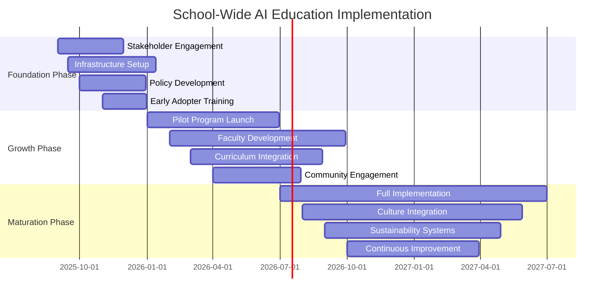

# 🗺️ Implementation Roadmap: School-Wide AI Adoption Guide

**Path:** `institutional/implementation-roadmap.md`  
**Repository:** [planetaryrestorationarchive/education](https://github.com/planetaryrestorationarchive/education)

---

## 📋 Table of Contents

Click to navigate

- [🎯 Executive Summary](#-executive-summary)
- [🔍 Readiness Assessment](#-readiness-assessment)
- [🗓️ Three-Phase Implementation Timeline](#️-three-phase-implementation-timeline)
- [👥 Stakeholder Engagement Strategy](#-stakeholder-engagement-strategy)
- [🛠️ Infrastructure & Resources](#️-infrastructure--resources)
- [📚 Professional Development Plan](#-professional-development-plan)
- [⚖️ Policy & Governance Framework](#️-policy--governance-framework)
- [📊 Success Metrics & Evaluation](#-success-metrics--evaluation)
- [🚨 Risk Management](#-risk-management)
- [💰 Budget Planning](#-budget-planning)
- [🌟 Sustainability Plan](#-sustainability-plan)
- [📞 Implementation Support](#-implementation-support)

---

## 🎯 Executive Summary

> [!IMPORTANT]
> **This roadmap transforms schools into conscious AI-learning communities where technology serves human flourishing.**

### Our Vision
**Every student graduates as an ethical AI collaborator,**  
**equipped to shape rather than simply use artificial intelligence,**  
**prepared to lead in a world where human and artificial intelligence dance together.**

### 🌟 Implementation Philosophy

**🌱 Organic Growth:** Start with willing early adopters, expand naturally  
**🤝 Human-Centered:** Technology serves pedagogical goals, not the reverse  
**⚖️ Ethics-First:** Establish ethical foundations before technical implementation  
**🔄 Iterative Learning:** Continuous improvement based on evidence and feedback  
**🌍 Whole Community:** Include all stakeholders in the transformation process

### 📈 Expected Outcomes *(3-Year Timeline)*

- **🎓 Student Achievement:** Enhanced critical thinking, creativity, and AI literacy
- **👩‍🏫 Teacher Empowerment:** Increased confidence and effectiveness with AI tools
- **🏫 School Culture:** Shift toward innovation, ethical reasoning, and future-readiness
- **🌐 Community Engagement:** Strong family and community support for AI education
- **📊 Measurable Impact:** Documented improvements in engagement, learning, and preparation

---

## 🔍 Readiness Assessment

### 📊 Before You Begin: School AI Readiness Audit

*Complete this assessment to determine your starting point and customization needs*

<strong>🏫 Organizational Readiness (25 points)</strong>

**Leadership Support** *(10 points)*
- [ ] **3 pts:** Administration actively champions AI education innovation
- [ ] **2 pts:** Administration is supportive but cautious about AI education
- [ ] **1 pt:** Administration is neutral/undecided about AI education
- [ ] **0 pts:** Administration is resistant to AI education initiatives

**Change Management Culture** *(8 points)*
- [ ] **2 pts:** School has history of successful technology integration
- [ ] **2 pts:** Faculty generally embrace innovation and change
- [ ] **2 pts:** Clear processes exist for piloting new educational approaches
- [ ] **2 pts:** School culture supports professional risk-taking and experimentation

**Resource Availability** *(7 points)*
- [ ] **2 pts:** Adequate budget available for AI education initiatives
- [ ] **2 pts:** Professional development time and funding available
- [ ] **2 pts:** Technology infrastructure can support AI tools
- [ ] **1 pt:** Human resources available to support implementation

<strong>👩‍🏫 Faculty Readiness (25 points)</strong>

**Technology Comfort** *(10 points)*
- [ ] **3 pts:** Most faculty comfortable with educational technology
- [ ] **2 pts:** Faculty willing to learn new technology with support
- [ ] **3 pts:** Some faculty already experimenting with AI tools
- [ ] **2 pts:** Technology coaches or mentors available

**Professional Learning Orientation** *(8 points)*
- [ ] **2 pts:** Faculty regularly engage in professional development
- [ ] **2 pts:** Collaborative learning culture among teachers
- [ ] **2 pts:** Faculty comfortable with student-led learning
- [ ] **2 pts:** Teachers willing to experiment with new pedagogical approaches

**AI Awareness** *(7 points)*
- [ ] **2 pts:** Faculty understand basic AI concepts and capabilities
- [ ] **2 pts:** Some faculty have personal experience with AI tools
- [ ] **2 pts:** Faculty express curiosity about AI in education
- [ ] **1 pt:** Faculty aware of AI ethical considerations

<strong>🏛️ Infrastructure Readiness (25 points)</strong>

**Technology Infrastructure** *(15 points)*
- [ ] **4 pts:** Reliable high-speed internet throughout school
- [ ] **4 pts:** Adequate devices for AI tool access (1:1 or shared)
- [ ] **3 pts:** IT support available for new tools and platforms
- [ ] **2 pts:** Network security policies accommodate educational AI tools
- [ ] **2 pts:** Data privacy protections in place

**Physical Environment** *(5 points)*
- [ ] **2 pts:** Flexible learning spaces that support collaboration
- [ ] **2 pts:** Quiet spaces available for focused AI work
- [ ] **1 pt:** Presentation capabilities for sharing AI-assisted work

**Policy Framework** *(5 points)*
- [ ] **2 pts:** Clear acceptable use policies for educational technology
- [ ] **2 pts:** Data privacy policies align with AI tool requirements  
- [ ] **1 pt:** Academic integrity policies address AI assistance

<strong>🌍 Community Readiness (25 points)</strong>

**Family Engagement** *(10 points)*
- [ ] **3 pts:** Families generally supportive of educational innovation
- [ ] **2 pts:** Strong parent-school communication systems
- [ ] **3 pts:** Families have adequate technology access at home
- [ ] **2 pts:** Diverse family perspectives included in school decisions

**Student Readiness** *(10 points)*
- [ ] **3 pts:** Students comfortable with technology for learning
- [ ] **2 pts:** Students demonstrate curiosity about AI and future technology
- [ ] **3 pts:** School culture encourages student voice in learning decisions
- [ ] **2 pts:** Students have experience with collaborative learning approaches

**Community Context** *(5 points)*
- [ ] **2 pts:** Local community values innovation and future-readiness
- [ ] **2 pts:** Community partners available to support AI education
- [ ] **1 pt:** Media and public opinion generally positive toward educational technology

### 📊 Readiness Score Interpretation

- **🟢 80-100 points:** Ready for full implementation - proceed with confidence
- **🟡 60-79 points:** Good foundation - address gaps before full rollout
- **🟠 40-59 points:** Significant preparation needed - focus on foundation building
- **🔴 Below 40 points:** Extensive groundwork required - start with culture and infrastructure

---

## 🗓️ Three-Phase Implementation Timeline

### 📅 Strategic Rollout Over 18-36 Months

*Flexible timeline adaptable to school context and resources*

<strong>🌱 Phase 1: Foundation Building (Months 1-6)</strong>

### 🎯 Primary Goals
- Build stakeholder understanding and support
- Establish ethical and technical foundations
- Create early adopter cohort
- Develop initial policies and procedures

### 📋 Key Activities

**Month 1-2: Leadership Alignment**
- [ ] Administrative team AI education workshop
- [ ] Vision and mission alignment sessions
- [ ] Resource allocation decisions
- [ ] Communication strategy development

**Month 2-3: Stakeholder Engagement**
- [ ] Faculty information sessions and input gathering
- [ ] Parent community education events
- [ ] Student voice sessions about AI in education
- [ ] Community partner outreach

**Month 3-4: Infrastructure Development**
- [ ] Technology needs assessment and procurement
- [ ] Network security and privacy protocol updates
- [ ] AI tool evaluation and selection
- [ ] IT staff training and preparation

**Month 4-6: Early Adopter Program**
- [ ] Recruit 3-5 enthusiastic faculty volunteers
- [ ] Intensive training for early adopters
- [ ] Small-scale classroom pilots
- [ ] Initial policy and procedure testing

### 📊 Success Indicators
- 80%+ faculty awareness of AI education initiative
- 90%+ administrative support for moving to Phase 2  
- Technical infrastructure ready for broader rollout
- 3-5 successful pilot implementations documented

<strong>🌿 Phase 2: Strategic Growth (Months 7-18)</strong>

### 🎯 Primary Goals
- Scale successful pilots to broader faculty adoption
- Integrate AI education into curriculum frameworks
- Build family and community support
- Develop sustainable professional development systems

### 📋 Key Activities

**Month 7-9: Pilot Program Expansion**
- [ ] Share early adopter successes and lessons learned
- [ ] Recruit second cohort of 8-12 teachers
- [ ] Expand to multiple grade levels and subjects
- [ ] Develop peer mentorship programs

**Month 10-12: Curriculum Integration**
- [ ] Map AI education to existing curriculum standards
- [ ] Develop grade-level learning progressions for AI literacy
- [ ] Create assessment frameworks for AI-integrated learning
- [ ] Build resource libraries and lesson plan collections

**Month 13-15: Faculty Development**
- [ ] Comprehensive professional development program launch
- [ ] Ongoing coaching and support systems
- [ ] Faculty AI education communities of practice
- [ ] Advanced training for teacher leaders

**Month 16-18: Community Engagement**
- [ ] Family AI literacy workshops and events
- [ ] Student AI showcases and presentations
- [ ] Community partner collaboration projects
- [ ] Media and communication about program successes

### 📊 Success Indicators
- 50%+ of faculty actively using AI in their teaching
- Students demonstrating measurable growth in AI literacy
- 75%+ family satisfaction with AI education program
- Clear curriculum pathways established for all grade levels

<strong>🌳 Phase 3: Full Integration & Sustainability (Months 19-36)</strong>

### 🎯 Primary Goals
- Achieve school-wide AI education integration
- Embed AI literacy in school culture and identity
- Establish systems for continuous improvement
- Position school as AI education leader

### 📋 Key Activities

**Month 19-24: Full Implementation**
- [ ] All willing faculty trained and supported in AI education
- [ ] AI literacy integrated across all subject areas
- [ ] Student-led AI ethics and innovation councils
- [ ] Advanced AI education offerings for interested students

**Month 25-30: Culture Integration**
- [ ] AI education becomes part of school identity and mission
- [ ] Students graduate with documented AI literacy competencies
- [ ] Faculty routinely collaborate on AI education innovations
- [ ] School serves as mentor to other institutions

**Month 31-36: Sustainability & Leadership**
- [ ] Self-sustaining professional development systems
- [ ] Student and faculty AI education leadership roles
- [ ] Research and publication about implementation lessons
- [ ] Regional or national AI education leadership activities

### 📊 Success Indicators
- 90%+ of faculty confident in AI education integration
- Students achieving advanced AI literacy benchmarks
- School recognized as AI education innovation leader
- Sustainable systems supporting continuous improvement

---

## 👥 Stakeholder Engagement Strategy

### 🤝 Building Coalition for Transformational Change

*Every stakeholder group has unique needs, concerns, and contributions*

<strong>🏛️ Administrative Leadership</strong>

### 🎯 Engagement Priorities
- Connect AI education to strategic school goals
- Address resource and risk management concerns
- Build confidence in implementation approach
- Establish clear success metrics and accountability

### 📋 Key Messages
- **Vision Alignment:** AI education serves school mission and student success goals
- **Competitive Advantage:** Forward-thinking AI education positions school as innovative leader
- **Risk Mitigation:** Thoughtful implementation reduces rather than increases risks
- **Resource Optimization:** AI tools can enhance efficiency while improving learning outcomes

### 🛠️ Engagement Activities
- **Executive Briefings:** Regular updates with data and success stories
- **Site Visits:** Observe AI education in action at other schools
- **Expert Consultations:** Connect with AI education researchers and thought leaders
- **Pilot Oversight:** Direct involvement in reviewing pilot program results

### 📊 Success Metrics
- Administrative approval for each implementation phase
- Resource allocation alignment with implementation needs
- Leadership advocacy for program in school board and community settings
- Integration of AI education into school strategic planning

<strong>👩‍🏫 Faculty & Staff</strong>

### 🎯 Engagement Priorities
- Address concerns about job security and competence
- Provide practical, supportive professional development
- Honor existing expertise while building new skills
- Create collaborative rather than competitive culture

### 📋 Key Messages
- **Enhancement, Not Replacement:** AI amplifies teacher expertise rather than replacing it
- **Professional Growth:** AI literacy is essential 21st-century educator competency
- **Student Service:** AI education better prepares students for their futures
- **Supportive Implementation:** Extensive support provided throughout learning process

### 🛠️ Engagement Activities
- **Listening Sessions:** Regular opportunities for questions, concerns, and input
- **Voluntary Participation:** No-pressure exploration opportunities before formal adoption
- **Peer Learning:** Teacher-to-teacher sharing and mentorship programs
- **Choice and Agency:** Multiple pathways for professional development and implementation

### 📊 Success Metrics
- Faculty satisfaction surveys showing positive responses to AI education initiative
- Participation rates in voluntary AI education professional development
- Peer collaboration and knowledge-sharing about AI education
- Teacher retention and recruitment advantages from AI education reputation

<strong>👨‍👩‍👧‍👦 Families & Parents</strong>

### 🎯 Engagement Priorities
- Address concerns about screen time and technology dependence
- Explain educational benefits and safety measures
- Provide transparency about AI use in their children's education
- Create opportunities for family AI literacy development

### 📋 Key Messages
- **Educational Purpose:** AI used specifically to enhance learning, not for entertainment
- **Safety First:** Comprehensive safety and privacy protections in place
- **Transparency:** Full disclosure about how and when AI is used in education
- **Future Preparation:** AI literacy essential for students' future academic and career success

### 🛠️ Engagement Activities
- **Information Sessions:** Regular presentations about AI education approach and benefits
- **Demonstration Events:** Opportunities to see AI education in action
- **Family Workshops:** AI literacy sessions for parents and caregivers
- **Home Extension:** Resources for continuing AI discussions at home

### 📊 Success Metrics
- Family satisfaction surveys showing support for AI education program
- Attendance at AI education information and demonstration events
- Reduced concerns and complaints about AI use in education
- Positive word-of-mouth promotion of school's AI education program

<strong>🧑‍🎓 Students</strong>

### 🎯 Engagement Priorities
- Ensure student voice in AI education design and implementation
- Address student concerns about AI and future implications
- Build excitement about AI collaboration opportunities
- Develop student leadership in AI ethics and innovation

### 📋 Key Messages
- **Partnership Approach:** Students as co-creators of AI education, not just recipients
- **Ethical Foundation:** Strong emphasis on responsible AI use and development
- **Future Agency:** AI education empowers students to shape rather than just adapt to AI future
- **Individual Growth:** AI collaboration enhances rather than diminishes unique human capabilities

### 🛠️ Engagement Activities
- **Student Voice Surveys:** Regular input on AI education experiences and preferences
- **Student Advisory Councils:** Ongoing student leadership in AI education program development
- **Peer Teaching:** Opportunities for students to teach AI skills to classmates and younger students
- **Innovation Projects:** Student-led AI projects addressing real community problems

### 📊 Success Metrics
- Student engagement and satisfaction with AI education activities
- Student leadership development in AI ethics and innovation
- Peer-to-peer teaching and collaboration around AI
- Student academic and personal growth through AI education experiences

<strong>🌍 Community Partners</strong>

### 🎯 Engagement Priorities
- Build local support for innovative educational approaches
- Connect school AI education to broader community needs
- Develop partnerships that enhance student learning opportunities
- Position school as community leader in preparing for AI future

### 📋 Key Messages
- **Community Benefit:** AI-literate graduates contribute to local economic and social development
- **Innovation Leadership:** School's AI education program demonstrates community forward-thinking
- **Partnership Opportunities:** Multiple ways for community members and organizations to support and benefit
- **Shared Future:** Community and school working together to navigate AI era

### 🛠️ Engagement Activities
- **Community Presentations:** Sharing AI education approach and results with local organizations
- **Business Partnerships:** Collaborations that provide real-world AI learning experiences
- **Community Problem-Solving:** Student AI projects addressing local challenges and opportunities
- **Media Relations:** Positive coverage of AI education innovations and successes

### 📊 Success Metrics
- Community support and advocacy for school's AI education program
- Partnerships providing learning and career opportunities for students
- Positive media coverage and community reputation enhancement
- Community investment in school AI education through resources or expertise

---

## 🛠️ Infrastructure & Resources

### 💻 Technical Foundation for AI Education Success

*Comprehensive infrastructure planning for sustainable implementation*

<strong>🌐 Network & Connectivity Requirements</strong>

### 📡 Bandwidth Specifications
- **Minimum:** 100 Mbps dedicated for AI education activities
- **Recommended:** 1 Gbps with redundant connections
- **Scalability:** Plan for 50% annual growth in bandwidth needs
- **Quality of Service:** Prioritize educational traffic during class hours

### 🔒 Security Considerations
- **Firewall Configuration:** Allow educational AI platforms while maintaining security
- **Content Filtering:** Balance safety with educational access needs
- **VPN Access:** Secure remote access for teachers and students
- **Regular Audits:** Quarterly security assessments of AI tool access

### 📊 Monitoring & Analytics
- **Usage Tracking:** Monitor bandwidth usage patterns and peak times
- **Performance Metrics:** Track response times and connectivity issues
- **Predictive Planning:** Use data to anticipate future infrastructure needs
- **Troubleshooting:** Real-time monitoring to identify and resolve issues quickly

<strong>💻 Device & Hardware Requirements</strong>

### 📱 Device Specifications

**Minimum Requirements:**
- **Processor:** Intel i5 equivalent or better
- **RAM:** 8GB minimum, 16GB recommended
- **Storage:** 256GB SSD minimum
- **Operating System:** Modern versions of Windows, macOS, or Chrome OS
- **Browser:** Latest versions of Chrome, Firefox, or Edge

**Recommended Setup:**
- **Teacher Devices:** High-performance laptops or desktops for demonstration and preparation
- **Student Access:** 1:2 or 1:1 device ratio depending on budget and pedagogical approach
- **Shared Resources:** Some high-performance devices for intensive AI tasks
- **Mobile Compatibility:** Ensure AI tools work on tablets and smartphones for flexibility

### 🖥️ Classroom Technology
- **Interactive Displays:** For sharing AI interactions and collaborative work
- **Audio Systems:** Clear sound for AI-generated audio content and presentations
- **Charging Solutions:** Reliable device charging infrastructure
- **Backup Equipment:** Replacement devices for quick issue resolution

<strong>🔧 Software & Platform Management</strong>

### 🛡️ AI Tool Evaluation Criteria

**Educational Value:**
- [ ] Aligns with curriculum standards and learning objectives
- [ ] Provides meaningful educational enhancement
- [ ] Supports diverse learning styles and needs
- [ ] Encourages critical thinking and creativity

**Safety & Privacy:**
- [ ] Strong data privacy protections
- [ ] Age-appropriate content filtering
- [ ] Clear terms of service and privacy policies
- [ ] Compliance with educational privacy laws (FERPA, COPPA, etc.)

**Technical Reliability:**
- [ ] Consistent uptime and performance
- [ ] Regular updates and improvement
- [ ] Responsive customer support
- [ ] Integration capabilities with existing systems

**Cost Effectiveness:**
- [ ] Reasonable pricing for educational use
- [ ] Clear understanding of total cost of ownership
- [ ] Free or trial options for evaluation
- [ ] Scalable pricing as implementation grows

### 📋 Recommended AI Platform Portfolio

**Tier 1 (Essential):**
- **Primary AI Assistant:** ChatGPT, Claude, or Google Bard for general use
- **Educational Platform:** AI-specific educational tools like Khan Academy's AI features
- **Content Creation:** AI writing and creative tools appropriate for education

**Tier 2 (Enhancement):**
- **Subject-Specific Tools:** AI platforms designed for specific curriculum areas
- **Advanced Features:** Image generation, video editing, or specialized analysis tools
- **Assessment Integration:** AI tools that work with existing grading and assessment systems

**Tier 3 (Innovation):**
- **Experimental Tools:** Cutting-edge AI platforms for advanced students and teachers
- **Custom Solutions:** School-specific AI implementations or partnerships
- **Research Platforms:** AI tools for faculty research and development

<strong>💰 Budget Planning & Resource Allocation</strong>

### 📊 Cost Categories & Estimates *(Annual, Per 500 Students)*

**Technology Infrastructure:** *$25,000 - $75,000*
- Network upgrades and maintenance: $15,000 - $40,000
- Device procurement and replacement: $10,000 - $35,000

**Software & Licensing:** *$5,000 - $20,000*
- AI platform subscriptions: $3,000 - $15,000
- Supporting software and tools: $2,000 - $5,000

**Professional Development:** *$10,000 - $30,000*
- Training programs and workshops: $5,000 - $15,000
- Conference attendance and expert consultations: $3,000 - $10,000
- Substitute coverage for training time: $2,000 - $5,000

**Support & Maintenance:** *$8,000 - $20,000*
- Technical support and troubleshooting: $3,000 - $8,000
- Curriculum development and resources: $3,000 - $7,000
- Evaluation and assessment tools: $2,000 - $5,000

**Total Annual Investment:** *$48,000 - $145,000*
*Range varies by school size, existing infrastructure, and implementation approach*

### 💡 Cost Optimization Strategies
- **Phased Implementation:** Spread costs over multiple years
- **Grant Funding:** Apply for technology and innovation grants
- **Community Partnerships:** Leverage local business and organization support
- **Shared Resources:** Collaborate with other schools to reduce per-school costs
- **Free Tier Usage:** Maximize use of free AI platform features

---

## 📚 Professional Development Plan

### 🎓 Comprehensive Faculty AI Education Training

*Multi-modal, sustained professional learning designed for diverse educator needs*

<strong>🌱 Foundation Level: AI Literacy for All Educators</strong>

### 🎯 Learning Objectives
By completion, all faculty will:
- Understand basic AI concepts and current capabilities
- Experience AI as a personal productivity tool
- Recognize ethical considerations in AI use
- Feel confident having basic AI conversations with students

### 📋 Training Components *(20 hours total)*

**Module 1: AI Awareness (5 hours)**
- What is AI? Demystifying artificial intelligence
- Personal AI tool exploration (ChatGPT, productivity apps)
- AI in daily life: recognition and impact assessment
- Future implications for education and society

**Module 2: Educational Applications (8 hours)**
- AI as teaching assistant: lesson planning, resource creation
- Student learning enhancement opportunities
- Observing AI-integrated lessons in action
- Hands-on practice with educational AI tools

**Module 3: Ethics & Safety (4 hours)**
- Ethical frameworks for AI in education
- Student privacy and data protection
- Bias recognition and mitigation strategies
- Academic integrity in the AI era

**Module 4: Classroom Integration (3 hours)**
- Starting small: simple AI integration strategies
- Student conversation facilitation about AI
- Assessment considerations for AI-assisted work
- Building support networks and resources

### 📊 Assessment & Certification
- Reflective portfolio documenting AI exploration and learning
- Lesson plan incorporating appropriate AI use
- Participation in peer discussion about AI ethics and education
- Commitment to continued AI literacy development

<strong>🌿 Intermediate Level: AI Integration Specialists</strong>

### 🎯 Target Audience
Faculty ready to implement AI education actively in their classrooms
*(Approximately 30-50% of faculty in Phase 2)*

### 📋 Advanced Training Components *(40 hours total)*

**Module 1: Pedagogical Framework (10 hours)**
- AI co-evolution educational philosophy deep dive
- Designing learning experiences that leverage AI thoughtfully
- Student agency and voice in AI-integrated learning
- Differentiation and personalization with AI support

**Module 2: Subject-Specific Integration (15 hours)**
- AI applications in specific curriculum areas
- Cross-curricular AI literacy development
- Advanced AI tools for specialized subjects
- Collaborative planning with department colleagues

**Module 3: Assessment & Evaluation (8 hours)**
- Assessing student growth in AI collaboration skills
- Academic integrity policies and practices
- Portfolio-based assessment for AI-integrated work
- Using AI to enhance rather than replace authentic assessment

**Module 4: Student & Community Engagement (7 hours)**
- Leading meaningful AI conversations with students
- Family and community communication about AI education
- Student AI ethics councils and leadership development
- Showcasing and celebrating AI-integrated learning

### 🏆 Outcomes & Recognition
- Advanced AI education certification
- Leadership role in school AI education implementation
- Mentorship responsibilities for foundation-level colleagues
- Opportunities for conference presentation and publication

<strong>🌳 Advanced Level: AI Education Leaders</strong>

### 🎯 Target Audience
Faculty demonstrating excellence in AI education integration, ready for leadership roles
*(Approximately 10-20% of faculty in Phase 3)*

### 📋 Leadership Development Components *(60 hours total)*

**Module 1: Systems Thinking (15 hours)**
- School-wide AI education implementation strategies
- Change management and innovation diffusion
- Policy development and governance frameworks
- Sustainability planning and continuous improvement

**Module 2: Research & Development (20 hours)**
- Action research methodologies for AI education
- Data collection and analysis for program improvement
- Publication and presentation of findings
- Collaboration with external researchers and institutions

**Module 3: Professional Learning Leadership (15 hours)**
- Adult learning principles applied to AI education
- Training design and facilitation skills
- Coaching and mentorship approaches
- Building professional learning communities

**Module 4: Community & Policy Engagement (10 hours)**
- School board and district-level advocacy
- Community partnership development
- Media relations and public communication
- Regional and national AI education leadership networks

### 🌟 Leadership Opportunities
- School AI education coordinator role
- District-level AI education advisory positions
- Conference keynote speaking and workshop facilitation
- University partnership and research collaboration
- Policy development consultation and advocacy

<strong>🔄 Ongoing Support & Learning Systems</strong>

### 📅 Regular Learning Opportunities

**Weekly AI Coffee Chats (30 minutes)**
- Informal discussion of AI tools and experiences
- Peer problem-solving and idea sharing
- Guest experts and student voices
- Optional attendance, high engagement

**Monthly Deep Dive Sessions (90 minutes)**
- Advanced AI tool exploration
- Student work analysis and discussion
- Ethics case study examination
- Research and best practice sharing

**Quarterly Innovation Showcases (2 hours)**
- Faculty presentation of AI education innovations
- Student demonstration of AI-assisted learning
- Community member participation and feedback
- Recognition and celebration of excellence

### 🤝 Peer Support Networks

**AI Education Mentorship Program**
- Experienced practitioners paired with newcomers
- Regular check-ins and classroom observation
- Collaborative lesson planning and reflection
- Emotional and technical support throughout implementation

**Subject-Area AI Communities**
- Discipline-specific AI integration focus groups
- Shared resource development and curation
- Cross-pollination between departments
- Subject-specific conference and professional development

**Innovation Labs**
- Faculty-initiated experiments with new AI tools
- Risk-taking and failure-friendly environment
- Documentation and sharing of lessons learned
- Seed funding for promising innovations

---

## ⚖️ Policy & Governance Framework

### 📜 Ethical Guidelines & Institutional Policies

*Comprehensive governance structure ensuring responsible AI education implementation*

<strong>🏛️ AI Education Governance Structure</strong>

### 🎯 Multi-Stakeholder Leadership Model

**AI Education Steering Committee**
- **Chair:** Assistant Principal for Curriculum & Instruction
- **Members:** 
  - Technology Coordinator
  - Department Representatives (2-3 faculty)
  - Student Representatives (2-3 elected)
  - Parent/Community Representative
  - School Board Liaison
- **Responsibilities:**
  - Strategic direction and policy development
  - Budget allocation and resource prioritization
  - Community communication and advocacy
  - Annual program evaluation and improvement planning

**AI Ethics Advisory Council**
- **Co-Chairs:** Faculty member and student representative
- **Members:**
  - Ethics or philosophy educator
  - School counselor or social worker
  - Community members with relevant expertise
  - Rotating student and faculty representatives
- **Responsibilities:**
  - Ethical framework development and review
  - Case consultation for complex ethical dilemmas
  - Training and education on AI ethics
  - Policy recommendation for ethical AI use

**Technical Implementation Team**
- **Lead:** Technology Coordinator or IT Director
- **Members:**
  - Network and systems administrators
  - Educational technology specialists
  - Faculty AI integration leaders
  - External consultants as needed
- **Responsibilities:**
  - Technical infrastructure planning and maintenance
  - AI platform evaluation and selection
  - Privacy and security protocol implementation
  - Technical support and troubleshooting

<strong>📋 Core Policy Documents</strong>

### 🛡️ AI Education Policy Framework

**1. Acceptable Use Policy for AI in Education**

*Defines appropriate and inappropriate uses of AI tools in educational settings*

**Appropriate AI Use:**
- Collaborative learning and exploration with teacher guidance
- Creative projects where AI contribution is transparent and documented
- Research and information gathering with critical evaluation
- Accessibility support for students with diverse learning needs
- Professional development and pedagogical enhancement for educators

**Inappropriate AI Use:**
- Completing assignments without disclosure or learning value
- Replacing human connection, creativity, or critical thinking
- Accessing inappropriate content or engaging in harmful interactions
- Violating privacy by sharing personal information about students or families
- Using AI in ways that discriminate against or harm individuals or groups

**2. Student Privacy and Data Protection Policy**

*Ensures protection of student information in AI-enhanced learning environments*

**Data Minimization Principles:**
- Only collect data necessary for educational purposes
- Use AI platforms with strong privacy protections and educational focus
- Avoid having students input sensitive personal information
- Regular review and deletion of unnecessary data

**Consent and Transparency:**
- Clear disclosure when AI tools are used in learning activities
- Parent/guardian consent for AI tool use by students under 13
- Student agency in deciding level of AI engagement where appropriate
- Regular communication about data use and protection measures

**3. Academic Integrity Standards for the AI Era**

*Redefines academic honesty expectations in context of AI collaboration*

**Disclosure Requirements:**
- Students must indicate when and how AI assisted their work
- Process documentation required for AI-integrated assignments
- Clear distinction between AI-assisted and independent work
- Honor system based on educational value rather than prohibition

**Assessment Adaptations:**
- Focus on learning process and critical thinking over final products
- Portfolio-based assessment showing growth over time
- In-class demonstrations of understanding and application
- Collaborative assessment involving peer and self-evaluation

<strong>🔍 Implementation Procedures</strong>

### 📋 AI Tool Evaluation and Adoption Process

**Phase 1: Initial Assessment (2-4 weeks)**
- Educational value and curriculum alignment review
- Privacy and security evaluation
- Cost-benefit analysis including total ownership costs
- Pilot testing with small group of faculty and students

**Phase 2: Community Review (2-3 weeks)**
- Stakeholder feedback collection from faculty, students, and families
- Ethics review by AI Ethics Advisory Council
- Policy alignment verification
- Risk assessment and mitigation planning

**Phase 3: Decision and Implementation (1-2 weeks)**
- Steering Committee decision based on evaluation data
- Communication plan for adoption or rejection decision
- Training and support resource development
- Rollout timeline and success metric establishment

### 🚨 Incident Response Procedures

**Level 1: Minor Issues (Single student or classroom)**
- Teacher addresses situation directly with affected students
- Documentation in classroom records
- Communication with parents if appropriate
- Adjustment of AI use practices as needed

**Level 2: Significant Concerns (Multiple students or serious ethical issues)**
- Immediate consultation with AI Ethics Advisory Council
- Administrative involvement and investigation
- Parent and community communication as appropriate
- Policy or procedure modification if needed

**Level 3: Crisis Situations (Safety, legal, or widespread harm)**
- Immediate suspension of relevant AI activities
- Crisis team activation including legal counsel
- Comprehensive investigation and external consultation
- Public communication and rebuilding trust plan

<strong>⚖️ Legal & Compliance Considerations</strong>

### 📜 Regulatory Compliance Framework

**Educational Privacy Laws**
- **FERPA Compliance:** Ensure AI tool use aligns with educational record privacy requirements
- **COPPA Compliance:** Age-appropriate consent and data protection for students under 13
- **State Privacy Laws:** Adherence to applicable state-level student privacy protections
- **Local Policy Alignment:** Integration with existing school board and district policies

**Accessibility Requirements**
- **ADA Compliance:** Ensure AI tools are accessible to students with disabilities
- **504 Plan Integration:** Use AI to support rather than hinder accommodated learning
- **Multi-language Support:** Consider non-English speaking families in AI education access
- **Digital Equity:** Address disparities in technology access and AI tool availability

**Intellectual Property Considerations**
- **Copyright Education:** Teach students about AI-generated content and copyright implications
- **Fair Use Guidelines:** Develop clear policies for educational use of AI-generated materials
- **Attribution Standards:** Establish expectations for crediting AI assistance in student work
- **Creative Commons:** Encourage sharing of successful AI education resources appropriately

### 🛠️ Policy Review & Updating Process

**Annual Policy Review**
- Comprehensive evaluation of all AI education policies and procedures
- Stakeholder feedback collection and analysis
- Research and best practice integration
- Policy update recommendations and implementation

**Quarterly Quick Updates**
- Rapid response to new AI developments or emerging issues
- Minor policy clarifications and procedure adjustments
- Stakeholder communication about changes
- Documentation of rationale for quick updates

**Emergency Policy Modification**
- Crisis-driven policy changes when immediate action is required
- Temporary measures with commitment to thorough review
- Transparent communication about emergency changes
- Plan for returning to normal policy development process

---

## 📊 Success Metrics & Evaluation

### 📈 Measuring Impact and Continuous Improvement

*Comprehensive assessment framework balancing quantitative data with qualitative insights*

<strong>🎯 Student Learning & Development Metrics</strong>

### 📚 Academic Achievement Indicators

**Traditional Academic Measures:**
- Standardized test performance in reading, mathematics, and science
- Course grades and GPA trends over implementation period
- College readiness indicators (SAT/ACT scores, advanced placement performance)
- Graduation rates and post-secondary education enrollment

**AI-Enhanced Learning Measures:**
- Critical thinking assessment scores using validated instruments
- Creative problem-solving portfolio evaluations
- Collaborative learning skill demonstrations
- Cross-curricular project quality and sophistication

### 🧠 AI Literacy Development

**Foundational AI Understanding:**
- Pre/post assessments of AI concept knowledge
- Ability to explain AI capabilities and limitations appropriately for age level
- Recognition of AI bias and ethical considerations
- Understanding of human-AI collaboration principles

**Applied AI Collaboration Skills:**
- Quality of AI prompting and interaction strategies
- Ability to critically evaluate AI-generated content
- Integration of AI assistance while maintaining authentic voice
- Documentation and reflection on AI collaboration process

**Ethical AI Reasoning:**
- Case study analysis demonstrating ethical thinking about AI scenarios
- Personal AI use guidelines development and adherence
- Peer teaching and leadership in AI ethics discussions
- Long-term thinking about AI impact on society and individuals

### 💚 Social-Emotional Learning Growth

**Self-Awareness and Agency:**
- Student confidence in technology use and learning
- Sense of agency in shaping their own education and future
- Recognition and articulation of personal learning preferences and goals
- Ability to self-advocate for learning needs and interests

**Relationship and Community Skills:**
- Collaborative learning and problem-solving with peers
- Empathy and perspective-taking in diverse group settings
- Communication skills in digital and face-to-face environments
- Leadership in ethical discussions and decision-making

<strong>👩‍🏫 Faculty Development & Engagement Metrics</strong>

### 🎓 Professional Learning Indicators

**AI Literacy and Competence:**
- Self-assessment surveys of AI knowledge and comfort level
- Observation rubrics for AI integration in teaching practice
- Professional learning portfolio documentation
- Peer collaboration and knowledge-sharing frequency

**Pedagogical Innovation:**
- Lesson plan quality and creativity incorporating AI tools
- Student engagement and learning outcome improvements
- Risk-taking and experimentation in educational practice
- Reflection and adaptation based on student feedback and results

### 💼 Job Satisfaction and Retention

**Professional Fulfillment:**
- Faculty satisfaction surveys including questions about AI education experience
- Professional growth and development opportunities utilization
- Leadership role participation and advancement
- External recognition and professional contribution (conferences, publications)

**Support and Community:**
- Perceived administrative and peer support for AI education innovation
- Professional learning community participation and leadership
- Mentorship relationship quality and impact
- Work-life balance and stress level indicators

<strong>🏫 School Culture & Climate Metrics</strong>

### 🌟 Innovation and Learning Culture

**Organizational Adaptability:**
- Speed and effectiveness of new initiative adoption
- Faculty and staff comfort with change and experimentation
- Student voice and agency in educational decision-making
- Community openness to educational innovation and risk-taking

**Collaboration and Communication:**
- Cross-departmental collaboration frequency and quality
- Parent and community engagement in school initiatives
- Student-led learning and teaching opportunities
- Transparent communication about challenges and successes

### 🌍 Reputation and Recognition

**External Recognition:**
- Media coverage and community perception of school AI education program
- Invitations to present or consult on AI education implementation
- Awards or recognition from educational organizations
- Interest from other schools or districts in learning from program

**Recruitment and Retention:**
- Teacher recruitment advantages due to AI education reputation
- Student and family school choice decisions influenced by AI education program
- Alumni feedback about preparation for college and career success
- Community pride and investment in school innovation

<strong>📊 Data Collection & Analysis Framework</strong>

### 📋 Mixed-Methods Assessment Approach

**Quantitative Data Collection:**
- Pre/post assessment surveys and tests administered annually
- Academic performance tracking using existing school data systems
- Engagement metrics from AI platform usage and interaction data
- Professional development participation and completion rates

**Qualitative Data Collection:**
- Focus groups with students, faculty, and families quarterly
- Individual interviews with key stakeholders annually
- Classroom observation notes and teaching practice documentation
- Student portfolio and reflection analysis

**Longitudinal Analysis:**
- Year-over-year comparison of key indicators
- Cohort tracking to measure long-term impact
- External benchmark comparison with similar schools
- Trend analysis to predict future needs and adjustments

### 📈 Continuous Improvement Process

**Monthly Data Review:**
- Quick pulse surveys and informal feedback collection
- Immediate issue identification and response
- Celebration of successes and positive developments
- Adjustment of implementation strategies based on emerging patterns

**Quarterly Assessment:**
- Comprehensive stakeholder feedback analysis
- Academic and social-emotional learning progress review
- Professional development needs assessment and response
- Community engagement and satisfaction evaluation

**Annual Evaluation:**
- Full program evaluation including external perspective
- Stakeholder satisfaction and impact comprehensive assessment
- Research and best practice integration into program improvement
- Strategic planning for following year based on evaluation results

---

## 🚨 Risk Management

### 🛡️ Proactive Risk Assessment & Mitigation

*Comprehensive approach to identifying and managing potential implementation challenges*

<strong>⚠️ High-Priority Risk Categories</strong>

### 🔒 Privacy & Data Security Risks

**Risk: Student Data Breach or Misuse**
- **Probability:** Medium | **Impact:** High
- **Mitigation Strategies:**
  - Comprehensive vetting of all AI platforms for privacy protections
  - Data minimization practices limiting collection to essential information
  - Regular security audits and compliance reviews
  - Staff training on data protection protocols
  - Incident response plan for data breaches
- **Monitoring:** Monthly security assessments, quarterly compliance reviews

**Risk: Inadequate Consent or Transparency**
- **Probability:** Medium | **Impact:** Medium-High
- **Mitigation Strategies:**
  - Clear, jargon-free communication about AI use to all stakeholders
  - Opt-out procedures for students and families uncomfortable with AI
  - Regular updates about data use and platform changes
  - Student and family education about AI and privacy
- **Monitoring:** Quarterly stakeholder surveys, annual consent review

### 🧠 Educational Quality Risks

**Risk: AI Dependency Undermining Learning**
- **Probability:** Medium-High | **Impact:** High
- **Mitigation Strategies:**
  - Clear guidelines distinguishing AI assistance from AI completion
  - Regular "AI-free" learning experiences to maintain independent skills
  - Focus on process and critical thinking over final products
  - Professional development emphasizing learning goals over efficiency
- **Monitoring:** Student assessment data, teacher observation, portfolio analysis

**Risk: Widening Achievement Gaps**
- **Probability:** Medium | **Impact:** High
- **Mitigation Strategies:**
  - Equitable access planning and resource allocation
  - Differentiated AI integration based on individual student needs
  - Professional development on inclusive AI education practices
  - Regular equity audits and adjustment protocols
- **Monitoring:** Disaggregated academic achievement data, student experience surveys

### 👥 Social & Emotional Risks

**Risk: Student Anxiety or Distress from AI Interaction**
- **Probability:** Medium | **Impact:** Medium-High
- **Mitigation Strategies:**
  - Trauma-informed AI education practices
  - Mental health support integration into AI education program
  - Student choice and agency in level of AI engagement
  - Regular emotional check-ins and support systems
- **Monitoring:** Counselor consultations, student self-reports, teacher observations

<strong>🔄 Risk Assessment & Response Protocols</strong>

### 📊 Risk Monitoring Framework

**Real-Time Alert System:**
- Daily monitoring of student and teacher reports of concerning incidents
- Automated alerts for unusual AI platform behavior or responses
- Regular communication channels for immediate risk reporting
- Rapid response team activation protocols for high-priority risks

**Weekly Risk Assessment:**
- Systematic review of incident reports and stakeholder feedback
- Analysis of AI platform performance and reliability issues
- Evaluation of emerging risks from new AI developments or policy changes
- Adjustment of mitigation strategies based on current data

**Monthly Risk Review:**
- Comprehensive analysis of risk trends and pattern identification
- Stakeholder consultation on risk perception and emerging concerns
- Assessment of mitigation strategy effectiveness and needed improvements
- Planning for potential future risks based on AI development trends

### 🚨 Crisis Response Procedures

**Level 1: Minor Risk Events**
- Individual teacher or classroom response with administrative support
- Documentation and reporting to appropriate school personnel
- Communication with affected students and families as needed
- Lesson learned integration into future prevention strategies

**Level 2: Significant Risk Events**
- AI Education Steering Committee activation and emergency meeting
- Temporary suspension of specific AI activities if necessary
- Comprehensive investigation and stakeholder consultation
- Communication plan for affected community members

**Level 3: Crisis-Level Events**
- Full crisis team activation including legal and external expertise
- Immediate suspension of all or most AI education activities
- Comprehensive public communication and transparency
- External review and comprehensive program evaluation before resumption

<strong>💰 Financial & Sustainability Risks</strong>

### 📉 Budget and Resource Risks

**Risk: Insufficient Funding for Implementation**
- **Probability:** Medium-High | **Impact:** High
- **Mitigation Strategies:**
  - Diversified funding sources including grants, partnerships, and budget allocation
  - Phased implementation allowing for budget spreading over multiple years
  - Cost-benefit analysis and ROI demonstration to stakeholders
  - Community partnership development for resource support

**Risk: Technology Obsolescence or Platform Changes**
- **Probability:** High | **Impact:** Medium
- **Mitigation Strategies:**
  - Platform diversification to avoid over-dependence on single AI tool
  - Professional development focusing on principles rather than specific tools
  - Regular technology refresh and upgrade planning
  - Vendor relationship management and contract negotiation

### 🏫 Institutional Risks

**Risk: Leadership Changes Affecting Program Continuity**
- **Probability:** Medium | **Impact:** Medium-High
- **Mitigation Strategies:**
  - Documentation of all policies, procedures, and institutional knowledge
  - Distributed leadership model not dependent on single individuals
  - School board and district-level advocacy and support building
  - Community champion development for external support

**Risk: Community or Political Opposition**
- **Probability:** Low-Medium | **Impact:** Medium-High
- **Mitigation Strategies:**
  - Proactive community engagement and transparent communication
  - Emphasis on educational benefits and safety measures
  - Student and parent voice in program advocacy
  - Media relations and positive story sharing

---

## 💰 Budget Planning

### 📊 Comprehensive Financial Planning for AI Education

*Strategic budget allocation ensuring sustainable and effective implementation*

<strong>📋 Three-Year Budget Overview</strong>

### 💡 Total Investment Summary *(500-student school)*

**Year 1 - Foundation ($65,000 - $95,000):**
- Infrastructure setup: $30,000 - $45,000
- Initial professional development: $15,000 - $25,000
- AI platform licensing (pilot): $5,000 - $10,000
- Program management and evaluation: $10,000 - $15,000
- Contingency and unexpected costs: $5,000 - $10,000

**Year 2 - Growth ($45,000 - $70,000):**
- Expanded professional development: $20,000 - $35,000
- Full AI platform licensing: $10,000 - $15,000
- Curriculum development resources: $8,000 - $12,000
- Community engagement activities: $5,000 - $8,000
- Evaluation and assessment tools: $2,000 - $5,000

**Year 3 - Sustainability ($35,000 - $55,000):**
- Ongoing professional development: $15,000 - $25,000
- Technology refresh and upgrades: $10,000 - $15,000
- Advanced AI tools and features: $5,000 - $10,000
- Research and development initiatives: $3,000 - $8,000
- Program leadership and advocacy: $2,000 - $5,000

**Three-Year Total: $145,000 - $220,000**
*Approximately $290 - $440 per student over three years*

<strong>💻 Technology Infrastructure Costs</strong>

### 🖥️ Hardware & Equipment Expenses

**Network Infrastructure:**
- Bandwidth upgrades: $8,000 - $15,000 annually
- Network security enhancements: $3,000 - $8,000 one-time
- WiFi infrastructure improvements: $5,000 - $12,000 one-time
- Network monitoring and management tools: $2,000 - $5,000 annually

**Device & Hardware:**
- Teacher devices (high-performance laptops): $2,000 - $4,000 per device
- Student device upgrades or procurement: $300 - $800 per device
- Shared high-performance workstations: $1,500 - $3,000 per unit
- Interactive displays and presentation equipment: $3,000 - $8,000 per classroom

**Maintenance & Support:**
- Hardware warranty and replacement: $5,000 - $12,000 annually
- Technical support staffing: $15,000 - $30,000 annually
- Equipment refresh cycle planning: $8,000 - $20,000 annually

### 💾 Software & Platform Licensing

**AI Platform Subscriptions:**
- Primary AI tools (ChatGPT Plus, Claude Pro, etc.): $2,000 - $8,000 annually
- Educational AI platforms: $3,000 - $10,000 annually
- Specialized subject-area AI tools: $1,000 - $5,000 annually

**Supporting Software:**
- Productivity and collaboration tools: $2,000 - $5,000 annually
- Assessment and portfolio platforms: $1,500 - $4,000 annually
- Privacy and security software: $1,000 - $3,000 annually

<strong>🎓 Professional Development Investment</strong>

### 👩‍🏫 Training & Education Costs

**Faculty Development Programs:**
- Foundation level training for all staff: $8,000 - $15,000
- Intermediate level training for active implementers: $5,000 - $10,000
- Advanced level training for leaders: $3,000 - $8,000
- Ongoing support and coaching: $4,000 - $10,000 annually

**External Learning Opportunities:**
- Conference attendance and professional development: $3,000 - $8,000 annually
- Expert consultation and specialized training: $2,000 - $6,000 annually
- University partnerships and research collaboration: $1,000 - $4,000 annually

**Internal Capacity Building:**
- Substitute teacher coverage for training: $5,000 - $12,000 annually
- Training material development and resources: $2,000 - $5,000
- Peer mentorship and support system management: $1,000 - $3,000 annually

### 📚 Curriculum & Resource Development

**Resource Creation:**
- Lesson plan development and adaptation: $3,000 - $8,000
- Assessment tool creation and validation: $2,000 - $5,000
- Student and family resource development: $1,500 - $4,000

**External Resources:**
- Educational research and publication subscriptions: $500 - $1,500 annually
- Curriculum consultants and specialists: $2,000 - $6,000
- Resource licensing and adaptation: $1,000 - $3,000 annually

<strong>💡 Funding Strategy & Resource Development</strong>

### 🏆 Grant Funding Opportunities

**Federal Grant Programs:**
- Title I School Improvement Grants (if applicable)
- Education Innovation and Research (EIR) grants
- National Science Foundation education grants
- Department of Education technology innovation funding

**State and Regional Grants:**
- State education department innovation grants
- Regional education cooperative funding
- Economic development and workforce preparation grants
- STEM education and 21st-century skills grants

**Private Foundation Funding:**
- Technology and education focused foundations
- Local community foundation grants
- Corporate education partnership funding
- Crowdfunding and community fundraising initiatives

### 🤝 Community Partnership Development

**Business and Industry Partnerships:**
- Technology company sponsorship and support
- Local business mentorship and internship programs
- Professional expertise and volunteer support
- Equipment donation and resource sharing

**Educational Partnerships:**
- University research collaboration and support
- Other school district resource sharing and cost splitting
- Professional organization partnership and advocacy
- Alumni network engagement and support

### 📊 Cost-Benefit Analysis & ROI

**Educational Benefits:**
- Improved student engagement and learning outcomes
- Enhanced teacher effectiveness and job satisfaction
- Increased school reputation and competitive advantage
- Better preparation for student future success

**Economic Benefits:**
- Increased teacher retention reducing recruitment costs
- Enhanced school choice attractiveness increasing enrollment
- Community economic development through AI-literate graduates
- Reduced costs through AI-enhanced administrative efficiency

**Long-term Return on Investment:**
- Student career preparation and earning potential enhancement
- Teacher professional development and career advancement
- School district leadership and innovation reputation
- Community economic development and competitiveness

---

## 🌟 Sustainability Plan

### 🔄 Long-Term Success & Continuous Evolution

*Building systems that ensure AI education becomes integral to school culture and operations*

<strong>🏛️ Institutional Sustainability</strong>

### 🧬 Embedding AI Education in School DNA

**Mission and Vision Integration:**
- Incorporate AI literacy and ethical technology use into school mission statement
- Include AI co-evolution principles in strategic planning and goal setting
- Establish AI education as core component of school identity and marketing
- Connect AI education to broader school values and community commitments

**Policy and Procedure Institutionalization:**
- Codify AI education policies in school board policy manuals
- Integrate AI considerations into all technology and curriculum policies
- Establish permanent governance structures for AI education oversight
- Create succession planning for AI education leadership transitions

**Cultural Transformation:**
- Shift from "AI education program" to "AI-integrated learning environment"
- Normalize AI collaboration as standard educational practice
- Celebrate and showcase AI education successes regularly
- Build expectation that all graduates have AI literacy competencies

### 📊 Systems and Structure Development

**Administrative Integration:**
- Include AI education responsibilities in key administrative job descriptions
- Establish budget line items for ongoing AI education support
- Create accountability systems for AI education quality and effectiveness
- Integrate AI education metrics into school evaluation and improvement processes

**Curriculum and Assessment Integration:**
- Embed AI literacy standards across all subject area curricula
- Include AI collaboration skills in graduation requirements
- Integrate AI education into teacher evaluation and professional development systems
- Establish AI education as expectation for all new faculty hires

<strong>👥 Human Capital Sustainability</strong>

### 🌱 Building Internal Capacity and Expertise

**Faculty Development Pipeline:**
- Recruit new teachers with AI education interest and experience
- Provide AI education training for all new faculty during onboarding
- Create career advancement pathways that include AI education leadership
- Develop internal expertise to reduce dependence on external consultants

**Student Leadership Development:**
- Establish student AI education council with meaningful decision-making authority
- Train students to co-teach AI literacy to peers and community members
- Create student mentorship programs for AI education skill development
- Develop student advocates for ethical AI development and use

**Community Engagement Sustainability:**
- Train parent and community volunteers to support AI education activities
- Develop ongoing community education programs about AI and education
- Create alumni network to support current AI education initiatives
- Build community partnerships that provide ongoing resources and expertise

### 🔄 Knowledge Management and Organizational Learning

**Documentation and Knowledge Preservation:**
- Create comprehensive documentation of all AI education policies and procedures
- Develop knowledge management systems to preserve lessons learned and best practices
- Establish protocols for sharing knowledge across staff transitions
- Build institutional memory that survives individual leadership changes

**Continuous Professional Learning:**
- Establish ongoing professional development as expectation rather than exception
- Create internal professional learning communities focused on AI education
- Develop peer coaching and mentorship systems for continuous improvement
- Build connections to external networks for ongoing learning and support

<strong>💰 Financial Sustainability</strong>

### 📈 Diversified and Stable Funding Model

**Core Budget Integration:**
- Transition AI education costs from "special project" to regular operational budget
- Build AI education costs into annual budget planning and allocation processes
- Establish endowment or reserve funds for AI education innovation and development
- Create fee structures (where appropriate) to support ongoing AI education costs

**Revenue Generation Opportunities:**
- Develop AI education consultation services for other schools and districts
- Create professional development offerings for external educators
- Establish research partnerships that provide funding for ongoing innovation
- Explore intellectual property development and licensing opportunities

**Cost Optimization Strategies:**
- Negotiate long-term contracts with AI platform providers for better pricing
- Develop shared service agreements with other schools for resource optimization
- Build internal capacity to reduce ongoing consultant and external support costs
- Implement efficiency improvements that reduce overall educational costs

### 🤝 Partnership and Community Investment

**Sustained Partnership Development:**
- Establish formal partnership agreements with key community organizations
- Develop corporate sponsorship programs with clear mutual benefits
- Create alumni giving programs specifically focused on AI education support
- Build university partnerships that provide ongoing research and development support

**Community Ownership and Investment:**
- Engage community members as stakeholders rather than just supporters
- Create volunteer opportunities that build community investment in program success
- Develop community advisory structures with meaningful influence and authority
- Build understanding that AI education benefits the entire community's future

<strong>🔮 Innovation and Adaptation</strong>

### 🚀 Staying Current with Rapid AI Development

**Technology Evolution Management:**
- Establish systematic processes for evaluating and adopting new AI tools and platforms
- Build flexibility into technology infrastructure to accommodate rapid change
- Develop faculty and student capacity for continuous learning and adaptation
- Create innovation labs for experimenting with emerging AI technologies

**Pedagogical Innovation:**
- Encourage and support ongoing experimentation with new AI education approaches
- Build connections to AI education research and development communities
- Establish processes for rapid pilot testing and evaluation of new strategies
- Create culture that embraces change and continuous improvement

**Future-Proofing Strategies:**
- Focus on developing principles and frameworks rather than tool-specific skills
- Build adaptability and learning agility as core competencies for students and staff
- Establish early warning systems for significant changes in AI development
- Create scenario planning processes for various AI development futures

### 🌐 Leadership and Influence

**Regional and National Leadership:**
- Position school as model and resource for other AI education implementations
- Develop faculty and administrative expertise for external consulting and training
- Build reputation as innovative leader in ethical AI education
- Create opportunities to influence policy and best practice development

**Research and Development Contribution:**
- Establish partnerships with universities and research institutions
- Document and publish findings from AI education implementation
- Contribute to development of field knowledge and best practices
- Build research capacity within school for ongoing evaluation and improvement

**Network Development:**
- Build relationships with other innovative AI education schools and districts
- Participate in professional networks and associations focused on AI education
- Create informal networks for sharing resources and support
- Establish mentorship relationships with schools beginning AI education implementation

---

## 📞 Implementation Support

### 🤝 Comprehensive Support for Your AI Education Journey

[%20723--5486-green?style=for-the-badge&logo=phone)](tel:+15877235486)

**Need help customizing this roadmap for your school?**  
**Ready to begin implementation but unsure where to start?**  
**Want expert consultation on your specific context?**

<strong>🎯 Customized Implementation Consulting</strong>

### 📋 Available Consultation Services

**Readiness Assessment & Strategic Planning**
- Comprehensive evaluation of your school's AI education readiness
- Customized implementation timeline based on your specific context
- Stakeholder engagement strategy development
- Risk assessment and mitigation planning specific to your community

**Technical Infrastructure Planning**
- Technology needs assessment and procurement guidance
- AI platform evaluation and selection support
- Network and security configuration recommendations
- Budget optimization and funding strategy development

**Professional Development Design**
- Customized training programs for your faculty's needs and interests
- Ongoing coaching and support system development
- Internal capacity building and sustainability planning
- Assessment and evaluation framework development

**Policy and Governance Support**
- AI education policy development and review
- Compliance and legal consideration guidance
- Community engagement and communication strategy
- Crisis management and risk response planning

<strong>🌐 Community Resources & Support Networks</strong>

### 💬 Ongoing Support Channels

**Implementation Community Hub**
- **Discord Server:** [Join 500+ implementing educators](https://discord.gg/planetary-restoration-implementation)
- **Monthly Office Hours:** Every second Wednesday, 4-5 PM EST
- **Resource Library:** Searchable database of implementation materials and examples
- **Success Story Sharing:** Regular showcases of successful implementations

**Peer Learning Networks**
- **Implementation Cohorts:** Small groups of schools implementing simultaneously
- **Mentorship Program:** Connect with schools that have completed implementation
- **Regional Meetups:** In-person gatherings for networking and support
- **Online Study Groups:** Subject-specific or role-specific learning communities

**Expert Access**
- **Ask-the-Expert Sessions:** Monthly Q&A with AI education specialists
- **Research Updates:** Quarterly briefings on latest AI education research
- **Policy Watch:** Updates on relevant legislation and policy developments
- **Innovation Spotlight:** Features on cutting-edge AI education developments

<strong>📚 Implementation Resource Library</strong>

### 🛠️ Ready-to-Use Tools and Templates

**Planning and Assessment Tools**
- Readiness assessment questionnaire (digital and print versions)
- Stakeholder engagement templates and communication guides
- Budget planning spreadsheets with cost calculators
- Risk assessment matrices and mitigation planning templates

**Training and Development Resources**
- Professional development curriculum modules and facilitator guides
- Student and family education materials and presentations
- AI literacy assessment tools and rubrics
- Reflection and evaluation instruments

**Policy and Governance Documents**
- Sample AI education policy templates
- Consent forms and communication templates
- Incident response procedures and documentation forms
- Evaluation and reporting templates

### 📖 Implementation Guides and Case Studies

**School-Specific Guides**
- Elementary school implementation guide (K-5)
- Middle school implementation guide (6-8)
- High school implementation guide (9-12)
- Multi-level school implementation strategies

**Context-Specific Resources**
- Rural and small school implementation adaptations
- Urban and large district implementation strategies
- Private and independent school considerations
- International and diverse cultural context adaptations

**Case Studies and Examples**
- Detailed documentation of successful implementations
- Challenge and problem-solving case studies
- Community engagement success stories
- Long-term sustainability examples

<strong>🏆 Recognition and Showcase Opportunities</strong>

### 🌟 Celebrating Implementation Success

**Implementation Recognition Program**
- AI Education Implementation Excellence Awards
- Peer recognition and voting systems
- Feature stories in educational publications
- Conference presentation and speaking opportunities

**Student and Faculty Showcase**
- Annual AI Education Innovation Fair
- Student project competitions and exhibitions
- Faculty innovation sharing and publication opportunities
- Community celebration and recognition events

**Research and Publication Support**
- Action research project development and support
- Publication assistance for implementation stories and findings
- Conference presentation proposal development and coaching
- Media relations support for positive implementation stories

### 🤝 Giving Back to the Community

**Mentorship Opportunities**
- Mentor other schools beginning implementation
- Contribute resources and templates to the community library
- Participate in research and evaluation studies
- Advocate for AI education policy development

**Leadership Development**
- Regional and national AI education leadership roles
- Professional development facilitation opportunities
- Policy advisory and consultation positions
- Community education and outreach leadership

---

### 🌟 Your Journey Toward AI Education Excellence

*"This roadmap is your invitation to transform education—*  
*not by adding technology to existing systems,*  
*but by reimagining learning itself.*

*Every school's journey is unique.*  
*Every community brings different strengths and challenges.*  
*But together, we're building a future where students and AI*  
*grow in wisdom, creativity, and purpose."*

---

**Stewarded by:** [Foster + Navi](mailto:admin@planetaryrestorationarchive.com) • **Planetary Restoration Archive**  
**License:** [Creative Commons Attribution-ShareAlike 4.0](../LICENSE) • **Version:** 1.1  
**Last Updated:** August 2025

